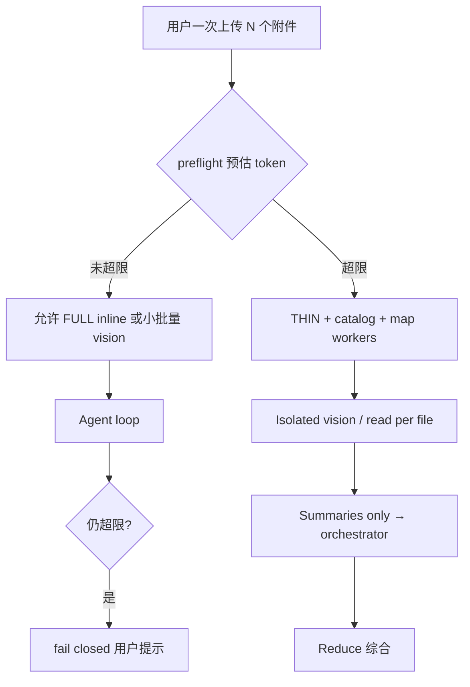
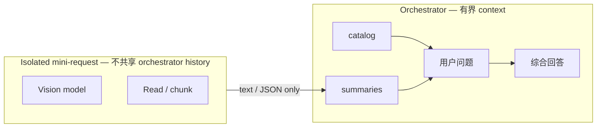
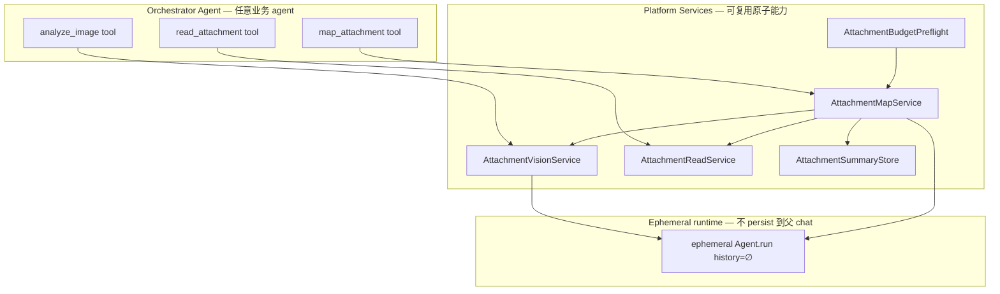

# 多附件 / 多图 Context 爆炸 — 设计方案

> **新专题**，与 [`ATTACHMENT_CONTEXT.md`](ATTACHMENT_CONTEXT.md) 互补：  
> 后者解决「长对话里同一附件反复 @ / replay 重复 inline」；  
> **本文**解决「一次上传多个 document/image，单轮或少数几轮内绝对 token 量超过模型上限」。

**典型报错**

```text
prompt is too long: 10239912 tokens > 1000000 maximum
```

这不是「稍微超窗」，而是**架构上把原始大 payload 在同一对话线程里线性/指数堆叠**。Prompt cache 救不了（第一次请求就发不出去）。

---

## 0. 实现 Truth 表（摘要 — canonical 见 ATTACHMENT §1.3）

> **不要在本节维护完整 Truth 表。** Canonical SSOT：[`ATTACHMENT_CONTEXT.md` §1.3](ATTACHMENT_CONTEXT.md)（含「验证方式」列、走查清单、commit 锚点 `6931bf7`）。  
> **同一 PR 规则：** 改状态、改 Phase、改 provider 矩阵时，**必须**同时改 ATTACHMENT §1.3 与本文件；review 时两份一起过。  
> 若你手上的 ATTACHMENT **没有 §1.3**，文档未同步——以仓库最新版为准，勿以 Multi §0 旧表为准。

**M0 缺口摘要（细节见 ATTACHMENT §1.3）：**

| 缺口 | 状态 |
|------|------|
| `analyze_image` isolated vision（无 base64） | ✅ PR2 |
| AttachmentPullMemoryProjector / persist strip | ✅ PR1 |
| preflight / `map_attachment` | ✅ PR3 |
| Provider 矩阵 + 结构化输出实测 | ❌ Phase 0 步骤 0 |

### 0.1 与 P1.1 的排期（禁止两条线抢同一批文件）

P1.1 与 M0 Phase 0 都动 `slimmer.py` / `projectors/` / `run_service` tool_result persist / visibility 语义。

**决策：合并为一条实施线 `M0-P1.1-unified`**

| 顺序 | 内容 | 中间态行为 |
|------|------|------------|
| 1 | Provider 矩阵验证（§0.3） | 未验证前不宣称 analyze_image 可用 |
| 2 | `AttachmentPullMemoryProjector` + persist strip | tool_result 只存 summary；与 visibility「何谓 full payload」一致 |
| 3 | Isolated vision mini-request | analyze_image 不再向 orchestrator 返 blob |
| 4 | Token preflight + inline/thin 门控 | 见 §4.5（**不用**静态 `max_inline_count=1`） |
| 5 | 摘要幂等 `(attachment_id, content_hash)` | DB 或 run cache 复用 |

**禁止：** 一个 PR 只改 projector、另一个 PR 改 visibility 规则而不对齐——会重复 P1.1 返工。

### 0.2 P1 × Pull × Map 交叉决策表

| 场景 | 走哪条 | 结果进 history |
|------|--------|----------------|
| 首次 `@` 单文件，preflight 未超限 | P1 FULL inline 或 `read_attachment` 精读 | user 行 full / tool summary |
| 多文件 send，preflight 超限 | THIN + catalog；按需 `map_attachment` | 仅 `AttachmentArtifactSummary` |
| 已有 summary，用户 `@` 追问细节 | **`read_attachment` / isolated vision 精读**（非 P1 stub 假 full） | 更新 summary；不 persist raw |
| visibility 窗内曾有 full，用户 `@` | P1 STUB → 若 summary 不够，**force pull** | stub 指向 last_full **或** summary 刷新 |
| 「对比 N 份合同条款」 | **结构化 map**（§3.2）→ reduce | 结构化 JSON 数组，非自由摘要 |
| map worker 失败 | `confidence: failed` 占位 | orchestrator 必须向用户说明 |

**测试用例（必做）：** 已有 summary 不含某具体数字 → 用户追问该数字 → 断言调用 `read_attachment` 而非编造。

### 0.3 Provider 兼容性矩阵（Phase 0 步骤 0 — 阻塞）

**步骤 0 交付物（须进 PR 描述或 `docs/attachment_provider_matrix.md` 附录）：**

1. ATTACHMENT §1.3 **走查清单**勾选  
2. 各 provider **实测记录**（非文档推断）  
3. 结构化抽取 **字段缺失率** baseline（Phase 1 门槛输入）

| Provider | tool_result 含 image | 可行 vision 路径 | 结构化 JSON 可靠性（待测） |
|----------|----------------------|------------------|---------------------------|
| Claude (Anthropic) | ✅ | mini-request 或主模型 vision | 高（baseline） |
| Azure OpenAI / GPT vision | ✅ | 同上 | 高 |
| **DeepSeek** | ❌ 纯文本 | **仅** hidden mini-request → summary | **待测** — JSON mode / tool 稳定性 |
| **DashScope / Qwen** | ❌ 纯文本 | 同上；vision 用 catalog VL 模型 | **待测** — 复杂 schema 漏字段率 |
| **MiniMax** | ❌ 纯文本 | 同上 | **待测** |
| Orchestrator = 纯文本 | N/A | mini-request **必须**切 vision deployment | N/A |

**Phase 1 结构化验收（若将来做 StructuredExtract）：** 固定合同样本 ≥30 次/ provider，记录字段缺失率。

**结论：** 国内模型 hidden vision mini-request 是 **协议硬约束**。
**Vision 路由（须画进架构）：**

```text
orchestrator (任意 text model)
  → analyze_image(attachment_id)
       → platform AttachmentVisionService
            → resize blob
            → ephemeral Agent.run(messages=[system, user+image], history=∅)  // 独立 session
            → vision_model from catalog (e.g. qwen-vl / claude / gpt-4o)
            → text summary only → tool_result JSON to orchestrator
```

**禁止：** 把 vision 图片作为 orchestrator 同一条 `messages` 里 tool_result 的一部分（当轮 N 图仍会堆满 **同一次** orchestrator 请求）。

---

## 1. 与现有方案的关系

| 文档 / 能力 | 解决什么 | 解决不了什么 |
|-------------|----------|--------------|
| P1 registry dedupe | 历史 replay 不重复 inline 同一附件 | 单轮内 5 个文件各 inline 一次仍爆 |
| P3 attachment compaction | 旧 turn user 行 snapshot/vision 占位 | tool_result 里的 base64 / 12 万字符 |
| P5 catalog + pull ✅ | 索引常驻；按需 page-in | analyze_image 仍 base64；无 isolated vision |
| P5c `first_turn_inline` | 单文件首 turn 低延迟 | 多文件 + 大 payload 时需 preflight 门控 |

**结论：** P5 索引层已就绪；缺 **Map-Reduce + ephemeral/durable 分流 + preflight**。

---

## 2. 根因定位（对照当前代码）

### 2.1 高概率叠加项

| # | 机制 | 代码位置 | 爆炸方式 |
|---|------|----------|----------|
| A | `analyze_image` 返回完整 base64 | `pull_tools.py` | persist + replay；同 run 多图线性增长 |
| B | `read_attachment` 最多 120k 字符 | `pull_tools.py` | 5 doc ≈ 60 万字符进 tool_result |
| C | 首 turn 全量 inline | `plan.py` + `first_turn_inline=true` | N vision block + 再 analyze → 双份 |
| D | 无 attachment 专用 projector | `slimmer.py` → Default 200 字 preview | 同 run 内 agent loop 仍全量 |
| E | 单 agent 单 history | MAF 默认 | 处理与综合共用 context |
| F | 无 preflight | — | 等 400 |
| G | 图片未降采样 | `load_inline_attachment` | 4K 图 token 浪费 |

### 2.2 失败形状



---

## 3. 设计原则

1. **处理 vs 综合分层**：Map 与 Reduce 物理隔离 context。
2. **大内容 ephemeral，小摘要 durable**：blob 不进 durable tool_result。
3. **Orchestrator 有界**：外层 ≈ `N × summary_size`（MVP 仅自由文本摘要）。
4. **Fail closed before 400**：preflight，不等 provider 报错。
5. **与 P5 叠加**：catalog SSOT；Pull 改返回值形态，不推翻 P1 visibility。

### 3.1 摘要 ≠ 永久丢失原文

| 层 | 存什么 | 精读 |
|----|--------|------|
| Blob / DB | 完整文件、snapshot | ✅ 永远可读 |
| History durable | Summary + 指针 | 默认摘要；**按需** `read_attachment` |
| 当次 ephemeral | 单文件 full / resize vision | 精读发生在这里 |

**同一次 orchestrator 请求内的 full 展开数量** 不由固定数字「1」硬编码，而由 **§4.5 token 预算**裁决：

- **默认倾向** 同时只展开 **少量** full payload（降低成本、避免堆叠）。  
- **预算允许时** 可 **同时展开多个** full — 例如用户要求「逐字对比 A、B 合同第 3 条原文」，在 preflight 通过的前提下允许 2 份 extract 同 request。  
- 实现：`max_concurrent_full_payloads` 为 **soft default**（如 1），preflight 可 override 提高。

**禁止：** 把 `max_concurrent_full_payloads=1` 写成不可突破的硬上限。

### 3.2 Map 产出（MVP：仅自由摘要）

| 任务类型 | 做法 |
|----------|------|
| 「分别总结 5 个文件」 | 5× **`map_attachment(id)`** → 5 段文字摘要 |
| 「对比 5 份合同违约条款」 | 5× **`map_attachment(id, focus=违约条款)`** → agent 在回答里做对比表 |
| 摘要把不准 / 要原文 | **`read_attachment`** 精读 |

**StructuredExtract（固定 JSON 字段）延后** — 见 §3.5。

### 3.3 摘要缓存（可选优化，人话见 §7.2）

同一文件、内容未变时，**第二次 `map_attachment` 直接读上次结果**，不必再跑一遍 LLM。可先落在 `chat_attachments.gist` 或内存，不必单独建「SummaryStore」大模块。

### 3.4 Worker 失败

| 情况 | 行为 |
|------|------|
| 单 worker 超时 / extract 失败 | 产出 `{ confidence: "failed", error: "…" }` |
| Reduce 前 | orchestrator 可见哪些 failed |
| 对用户 | 明确说明「N 个文件中 M 个未能解析」，**禁止** silent 跳过或假装完整 |

### 3.5 StructuredExtract（延后，非 MVP）

**是什么：** 强制按固定 JSON 字段（违约金额、期限…）抽合同，方便机器对比。

**先不要的影响：**

| 用户任务 | 没有 structured 时 | 够吗 |
|----------|-------------------|------|
| 分别总结 N 个文件 | `map_attachment` 自由摘要 | ✅ |
| 五份合同条款对比 | 5×`map_attachment(focus=…)` + agent 写对比表 | ⚠️ 多数够，偶发漏字段 |
| 逐字对比某一条 | `read_attachment` 精读 | ✅ |
| 要 JSON 落库对接下游系统 | 暂无 | ❌ 那时再加 |

**风险：** 对比类偶发漏项 → 在 **`map_attachment` tool description**（辅：`platform_instructions` 一句总括）要求「每个 id 单独 map」；仍不够再开 structured。**禁止**写进各 agent 的 `system_prompt.md`。

---

## 4. 目标架构



### 4.1 `AttachmentArtifactSummary`（自由摘要）

见 §3.2；durable 层禁止 `data_base64`、>8k raw extract。

### 4.2 Map 阶段

| 场景 | 行为 |
|------|------|
| 单 doc | isolated worker：`read` → summarize → discard worker messages |
| 大 PDF | chunk map → worker 内 reduce |
| 单图 | **resize → isolated vision mini-request** → 文字 summary |
| N 文件 | N workers（可并行）；orchestrator 只收 N 条 summary/struct |

**M1 升级为硬约束（非「最好这样做」）：**

- `analyze_image` **不得**向 orchestrator 返回 `data_base64`。
- Vision **必须**在 `AttachmentVisionService` 内完成：**独立 `Agent.run`，history=空**，仅 summary 回传。
- Orchestrator 主模型无 vision → mini-request 使用 catalog 配置的 vision deployment。

### 4.3 Reduce 阶段

- 输入：catalog + 若干 **`map_attachment` 返回的摘要** + 用户问题。
- 需要原文级精度 → `read_attachment` 精读。
- 禁止：N 个 base64 / N 篇 120k 全文同一 request。

### 4.4 Tool result 生命周期

| Tool | Orchestrator 可见 | Persist / replay |
|------|-------------------|------------------|
| `map_attachment` | 自由文本 summary | summary + projector |
| `analyze_image` | summary JSON only | 同上 |
| `read_attachment`（精读） | 当次可见 full | ≤4k 摘要 + `full_available` |

实现：`AttachmentPullMemoryProjector` + `run_service` persist strip（双保险）。

### 4.5 Token 门控：inline / THIN / Map

**禁止**静态 `max_inline_count=1` 默认（见上一版 review）。

**统一规则：**

```python
estimated = (
    estimate_text_tokens(tools, system, history, summaries)  # 文本：tiktoken / 厂商 estimate API
    + sum(
        estimate_vision_tokens(image, provider=vision_model)  # 图片：按 vision 模型分函数
        for image in planned_images
    )
)
limit = model_context_limit * safety_ratio

if estimated <= limit:
    allow FULL inline / 同 request 多小图（含 §3.1 多 full 对比场景）
elif estimated <= limit * map_threshold:
    THIN + catalog
else:
    mandatory map workers
```

**图片 token 估算（必须分 provider / vision 模型，禁止单一像素公式）：**

| 模型族 | 估算策略 |
|--------|----------|
| OpenAI / Azure GPT-4o 系 | patch/tile 规则或官方 estimate API |
| Anthropic Claude vision | `count_tokens` API（含 image blocks） |
| Qwen-VL / DashScope | 百炼 estimate 或文档 tile 公式 |
| DeepSeek / GLM / MiniMax | 各走 OpenAI-compat estimate；**无官方 API 时用保守上界**（宁可 THIN 不误伤 FULL） |

文本部分（tools/system/history）用统一近似即可；**门控误判主要来自图片**，故 vision 分支必须 `provider-aware`，并在 Phase 0 用真实附件样本校准偏差。

配置：

```yaml
memory.attachment_budget:
  enabled: true                    # feature flag — 见 §7.1
  safety_ratio: 0.85
  map_threshold_ratio: 1.2
  max_concurrent_full_payloads: 1   # soft default；preflight 可 override
  max_tool_result_persist_chars: 4096
  vision_estimate_provider: auto   # 跟 mini-request vision 模型走
```

`first_turn_inline`：仅 preflight 通过时生效。

### 4.6 图片降采样（Phase 0）

- `ATTACHMENT_VISION_MAX_EDGE` 默认 1568
- JPEG quality 85；写入 summary metadata

### 4.7 Map-Reduce 实现形态（Tool / Service / Sub-agent）

**结论先说：** Map-Reduce **不是**再建一个 `backend/agents/map-worker` 可部署 agent；而是 **平台 `platform/attachments/` 下的可复用 Service + 薄 Tool 门面**。Sub-agent 仅指 **运行时 ephemeral LLM 调用**（空 history 的 mini-run），不进入 agent catalog。

#### 4.7.1 三层分工



| 层 | 是什么 | 谁调用 | 是否可复用 |
|----|--------|--------|------------|
| **Service** | Python 模块，无 `@tool` | Tool 实现、preflight、未来 batch API | ✅ **核心复用单元** |
| **Tool** | `@tool` 暴露给 orchestrator LLM | 所有 agent（`builtin_registry`） | ✅ 全平台同一套 |
| **Ephemeral sub-run** | 单次/短链 `Agent.run`，**不**挂父 chat history | Service 内部 | ✅ 实现细节，非独立 agent |

#### 4.7.2 建议目录与职责（拟新增）

```
backend/app/platform/attachments/
├── services/
│   ├── vision.py          # AttachmentVisionService — resize + isolated vision LLM
│   ├── read.py            # AttachmentReadService — extract / chunk / query filter
│   ├── map.py             # AttachmentMapService — map_attachment 内部
│   ├── summary_store.py   # 可选：gist 复用上次摘要（不必独立大模块）
│   └── preflight.py       # THIN vs inline（不自动 map）
├── tools/
│   └── pull_tools.py      # 薄门面：调 Service，禁止塞 base64 出参
```

**原子能力（可复用）：**

| Service 方法（示意） | 输入 | 输出 | 复用场景 |
|---------------------|------|------|----------|
| `VisionService.describe(blob, question?)` | 图片 bytes | `AttachmentArtifactSummary` | `analyze_image`、map 内看图、content-studio 缩略图 |
| `ReadService.extract_text(id, query?, page?)` | attachment_id | str（可 chunk） | `read_attachment`、map doc、proposal 引用 |
| `MapService.map_one(id, focus?)` | 单 id | 自由文本 summary | **仅** `map_attachment` tool 调用 |
| 摘要缓存（见 §7.2 人话） | 同文件同内容 | 复用上次 summary | 多轮追问省钱 |

任何 agent **只声明 allowed_tools**（含 `map_attachment`），不复制 map 逻辑。

#### 4.7.3 谁触发 Map？——**只走显式 tool**

| 做什么 | 谁触发 | 说明 |
|--------|--------|------|
| **单文件「读一遍出摘要」** | Agent 调 **`map_attachment(id)`** | 平台在 tool 内做 isolated read/vision，只返 summary |
| **看图** | Agent 调 **`analyze_image(id)`** | 内部 VisionService；只返 summary（不返 base64） |
| **精读全文** | Agent 调 **`read_attachment(id)`** | 当次可见 full；persist 仍瘦身 |
| **多文件** | Agent **按需多次**调 `map_attachment` | 不自动帮用户 map 全部 |

**不做：** `run_service` 在 `agent.run` 前**静默** map 全部附件（隐式编排）。  
Preflight 只负责 **FULL / THIN / 能不能 inline**，**不代替** agent 决定 map 哪个 id。

Reduce = orchestrator 在拿到若干 summary 后正常回答；**没有** `reduce_attachment` tool。

#### 4.7.4 Sub-agent 在 MAF 里具体指什么

**不是：** 在 `backend/agents/` 新建 `map-worker` profile、MCP、skills。

**而是：** `platform/attachments/services/ephemeral.py`（示意）：

```python
async def ephemeral_llm_run(
    *,
    instructions: str,          # 固定模板 — worker 间字节一致，利于 Auto cache
    user_content: str | Message,
    model_id: str,              # catalog vision / text 模型
    tools: None,                # map 内通常无 tool loop，或只 read chunk
) -> str:
    """独立 Agent.run；不写入父 chat SessionStore；messages 不 merge 进 orchestrator。"""
```

- **简单图/短 doc：** 一次 `ephemeral_llm_run` 即 map 完成。  
- **大 PDF：** MapService 内 **for chunk in chunks: ephemeral_llm_run** → worker 内 reduce（仍不进入父 history）。  
- **需要 tool loop 的复杂 map（少见）：** 可用 `AgentFactory.build(..., chat_id=ephemeral_uuid)`，run 结束即丢弃 session。

父 orchestrator 的 `messages` **永远**只增加一条 tool_result JSON（summary），不增加 worker 内部 messages。

#### 4.7.5 Tool 表面 API

**Phase 0（改造现有 pull）：**

| Tool | 实现 |
|------|------|
| `analyze_image` | → VisionService → **只返 summary** |
| `read_attachment` | → ReadService；精读当次可见 full；persist 截断 |

**Phase 0 同期或紧接（显式 map，建议不要拖 Phase 1）：**

```python
@tool(name="map_attachment")
def map_attachment_tool(
    attachment_id: str,
    focus: str | None = None,   # 可选：「只看第三章」「违约条款」
) -> dict:  # AttachmentArtifactSummary（自由文本摘要）
    return MapService.map_one(...)
```

- **只有自由文本 summary**（structured 见 §3.5 延后）。
- 用户说「总结这五个文件」→ agent **自己调 5 次** `map_attachment`（或后续加 `map_attachments_batch`），平台不偷偷 map。
- **模型路由纪律**写在各 tool 的 `@tool(description=…)`（§5.3），不在 agent `system_prompt.md`。

`map_attachments_batch`：**二期**，非 MVP。

#### 4.7.6 与「可复用能力」的关系

| 问题 | 答案 |
|------|------|
| 要提前构建 tool 吗？ | Phase 0：**改** pull tools + **加** `map_attachment` |
| 要 subagent 吗？ | **要 ephemeral run 原语**，不要新 deployable agent |
| 原子能力可复用吗？ | **是** — Service 层可被 tool、preflight、未来 REST、其它 agent 插件 共用 |
| 单个 agent 要改 instructions / profile 吗？ | **否**。不改 `system_prompt.md`；仅需时把 `map_attachment` 等加入 `allowed_tools` |
| 模型如何知道 map vs read？ | **主：** tool `description`；**辅：** `platform_instructions.py` 短总括（§5） |

**反模式：** 平台静默 map 全部附件；在 `agent_specific` 或 agent `system_prompt.md` 复制 map 纪律；只靠 system 不写 tool description；tool 返 base64。

#### 4.7.7 平台默认路径（显式 map）

```text
用户上传 N 个附件
  → catalog 注入（索引）
  → send：preflight 决定 THIN 还是可 inline（不自动 map）
  → agent 根据用户问题 **显式** 调 map_attachment / analyze_image / read_attachment
  → 综合回答
```

业务 agent 开发者：**零配置** — builtin tools 已注册；**不修改** `backend/agents/<slug>/system_prompt.md`。

---

## 5. 模型可见的平台约束（零 per-agent 配置）

> **原则：** 凡影响全 agent 的附件行为（map/read 路由、多文件反模式、幻觉禁令），一律由 **平台代码** 注入；**禁止**下沉到各 agent 的 `system_prompt.md` 或业务 `instructions`。

### 5.1 三层注入（分工）

| 层级 | 代码位置 | 写什么 | 优先级 |
|------|----------|--------|--------|
| **Tool description** | `attachments/tools/pull_tools.py`（及 `map_attachment`） | 本 tool 用途、与互斥 tool 的分工、多文件反模式 | **主** — 模型 **选 tool** 时最直接 |
| **Platform instructions 尾部** | `platform/agent/platform_instructions.py` → `append_platform_instructions()` | 跨 tool 的 **1–3 句**总括（catalog=索引、禁止编造） | **辅** — 补强，不重复长文 |
| **Catalog context** | `AttachmentCatalogContextProvider` | `id` / `filename` / `gist` 索引行 | **数据**，非纪律文案 |
| **Agent system prompt** | `backend/agents/<slug>/system_prompt.md` | 仅业务领域指令 | **禁止**写附件 map/read/token 纪律 |

`platform_instructions` **不是**让你改 agent 的 `system_prompt.md`；它是 `AgentFactory` 在构建时 **追加**到 profile instructions 之后的平台段（与取消标记、附件总括等同一块）。

### 5.2 Tool description 纪律（M0 必改 — 主战场）

在 `@tool(description=…)` 中写清互斥与路由（实现时中英一致即可，以下为语义）：

| Tool | 何时用 | 何时不用 / 互斥 |
|------|--------|-----------------|
| `map_attachment(id, focus?)` | 多文件「分别总结 / 对比主题 / 按 focus 概括」；**每个相关 id 调一次** | 逐字精读、要具体数字/条款原文；单文件且已在本轮 inline 足够时 |
| `read_attachment(id, query?)` | 精读全文或 `query` 过滤；逐字对比；摘要里没有的金标准细节 | **禁止**对 N 个文件各调一次来做「概括/总结 N 份」任务（用 `map_attachment`） |
| `analyze_image(id, question?)` | 单图细看、图表/截图问答 | 非图片；多图「分别总结」优先 `map_attachment`（或按实现约定与本 tool 二选一，须在 description 写死） |
| `search_attachments(query)` | 附件多、需按文件名/gist 找 id | 替代 map/read 读内容 |

**实现要求：** 三个 pull/map tool 的 description **互相引用**（例如 `read_attachment` 明确写 "Do not call this N times to summarize N documents; use map_attachment instead"）。

### 5.3 Platform instructions 辅写（短 — 不替代 tool description）

`platform_instructions.py` 的 `_ATTACHMENT_*` 块只保留 **总括**，例如：

- Catalog 是 **索引**，gist 不足以支撑「已读全文」的声称。
- 多文件需内容：概括/对比 → `map_attachment`；精读/数字/逐字 → `read_attachment` / `analyze_image`。
- 摘要中未出现的具体事实 **必须** pull，禁止编造（对齐 §11 TC-C1）。

**禁止**在 platform instructions 里粘贴整表 tool 参数说明（避免与 schema 重复、抢 context）。

### 5.4 Agent profile 变更范围

| 允许 | 禁止 |
|------|------|
| `profile.yaml` → `allowed_tools` 增加 `map_attachment`（若默认未全开） | 改 `system_prompt.md` 加附件纪律 |
| 无附件需求的 agent 保持现状 | 在 `agent_specific/` 复制 map 逻辑或私有 `@tool` |
| — | 要求业务方「在自己的 prompt 里教用户怎么 @ 附件」以外的平台路由 |

### 5.5 反模式

- 在 content-studio / proposal 等 **`system_prompt.md` 写「多文件先 map」** — 应改 tool description + platform 尾部。
- **只靠** `platform_instructions`、**不更新** tool description — 模型仍易连调 N 次 `read_attachment`。
- 在 `agent_specific` 为单 agent 定制 pull/map 文案 — 破坏全平台一致性与零配置。

---

## 6. 成本与延迟（业务预期）

| 路径 | LLM 调用次数（5 文件） | 相对延迟 | Prompt cache |
|------|------------------------|----------|--------------|
| 轻量：2 小图 preflight 通过 | **1** | 低 | orchestrator 稳定前缀可命中 |
| 强制 map + reduce | **6+**（5 worker + 1 reduce） | 高 | 见下行 |
| 当前爆炸路径 | 1（失败）或 1（极贵） | — | 无 |

**Worker 前缀与 Auto cache（DeepSeek / Qwen / MiniMax）：**  
Map 路径并非「完全 cold」——若各 worker 使用 **字节一致的固定 system/指令模板**（文件相关内容仅出现在模板**之后**），从第 2 个 worker 起，模板段有机会命中厂商 **Auto 前缀缓存**；文件段天然不同不会命中。成本表应理解为「文件 payload 段 cold」，而非整请求 cold。实现要求：worker prompt 遵守 ATTACHMENT §10「稳定前缀」规范（与 orchestrator 无关，零额外 API）。

**结论：** Map-Reduce 用 **延迟 + 多次调用** 换 **不 400**；preflight 保留轻量单请求路径。

---

## 7. 分阶段落地（简化版）

### 7.1 人话：几个容易懵的概念

| 文档里的词 | 人话 | MVP 要不要 |
|------------|------|------------|
| **SummaryStore / 摘要幂等** | 同一份文件已经 map 过一次，**别重复花钱再 map**。像浏览器缓存：url 没变就不重新下载。实现：gist 字段或简单 dict 存 `(attachment_id + 文件hash) → 摘要文本` | 建议有，**很小**；可先用 gist，不必单独模块 |
| **Feature flag / 开关** | 线上出问题能 **只关某一功能**，不用整包回滚。例如：vision 新逻辑有 bug → 关 `ATTACHMENT_VISION_SERVICE_ENABLED`，其它止血（不写 base64 进 DB）仍生效 | 建议 **2 个开关**：vision 服务、preflight |
| **分 PR** | **分几次提交代码**，每次改少一点、好 review、好回滚。不是多建几个 agent | PR1 瘦身 persist；PR2 vision；PR3 map_attachment + preflight |
| **Preflight** | 发请求前 **算一下会不会太长**；太长就 THIN send，别让 API 报 400 | 要，可先粗糙 |
| **隐式 map** | 用户一上传平台 **偷偷**帮 map 全部文件 | **不做**（你已选显式 tool） |

### 7.2 MVP 范围（建议一次想清楚）

```text
必做
  ├── analyze_image / read_attachment：只返 summary 或当次 full，persist 瘦身
  ├── map_attachment(id, focus?)     ← 显式，agent 自己调
  ├── tool description 互斥纪律（§5.2）+ platform_instructions 短总括（§5.3）
  ├── VisionService（国内看图）
  ├── preflight：THIN vs 可 inline（不自动 map）
  └── 摘要缓存：复用 gist（可选但便宜）

不做（二期）
  ├── StructuredExtract + schema
  ├── map_attachments_batch
  ├── 平台静默 map 全部附件
  └── 精细 per-provider vision token 公式（先保守估）
```

### Phase 0 — 止血 + 显式 map

| 步骤 | 项 |
|------|-----|
| 1 | persist / tool_result 不写 base64、不写 120k 全文 |
| 2 | `analyze_image` → VisionService |
| 3 | **`map_attachment` tool** + MapService |
| 4 | **§5.2** 更新 pull/map tool `description`；**§5.3** 同步 `platform_instructions.py`（**不改**任何 agent `system_prompt.md`） |
| 5 | preflight：THIN vs inline（**不**自动 map） |
| 6 | 图片 resize |
| 7 | gist 复用上次 summary（简单缓存） |

**验收：** TC-A1、B1、B2、C1、E1。

### Phase 1（按需）

- `map_attachments_batch`（少调几次 tool）
- 大 PDF 分 chunk map
- StructuredExtract（仅当对比类漏项成为真实痛点）

### Phase 2

- metrics、更准的 vision token 估算

---

## 8. 测试计划（与 §11 对照）

§11 为完整验收场景；本节为 Phase 里程碑速查：

| 里程碑 | 必过 Case |
|--------|-----------|
| Phase 0 | TC-A1, A2, C1, E1, F1, F3, B1 |
| Phase 1 | TC-D1, D2, B3, F2 |

建议自动化：`tests/test_attachment_map_reduce.py`、`tests/test_attachment_tool_result_slim.py`（待建）。

---

## 9. 配置汇总

| 键 | 默认 | 含义 |
|----|------|------|
| `ATTACHMENT_VISION_MAX_EDGE` | 1568 | resize |
| `ATTACHMENT_TOOL_RESULT_MAX_CHARS` | 4096 | persist 上限 |
| `memory.attachment_budget.enabled` | false → true | preflight 开关 |
| `ATTACHMENT_VISION_SERVICE_ENABLED` | false → true | isolated vision |
| `memory.attachment_pull.persist_summary_only` | false → true | projector strip |
| ~~`max_inline_count`~~ | — | **已废弃** |

---

## 10. 相关代码

| 区域 | 路径 |
|------|------|
| Pull tools（门面 + **tool description 主战场**） | `attachments/tools/pull_tools.py` |
| Platform instructions 尾部（辅） | `platform/agent/platform_instructions.py` |
| Map / Vision / Read（**拟**） | `attachments/services/` — 见 §4.7 |
| Plan / thin | `materialization/plan.py` |
| Visibility | `materialization/visibility.py` |
| Persist | `chat/run_service.py` |
| Slim / projector | `memory/slimmer.py`, `projectors/` |
| Catalog | `attachments/catalog/` |
| 上游 SSOT | [`ATTACHMENT_CONTEXT.md`](ATTACHMENT_CONTEXT.md) §1.3 |

---

## 11. 验收场景（Test Cases）

> 用于验证方案是否解决 context 爆炸，并覆盖轻量路径、精读、对比、国内 vision、replay。  
> **目标态** = M0/M1 落地后；**现状** = commit `6931bf7` 后、M0 未做时的典型表现。

### 11.1 观测字段（每条 case 建议记录）

| 字段 | 说明 |
|------|------|
| `preflight.estimated_tokens` / `decision` | FULL / THIN（无 MAP 决策） |
| send 路径 | user 行 FULL vs THIN 数量 |
| tool 调用 | `read_attachment` / `analyze_image` / `map_attachment` 次数与返回字节 |
| LLM 调用次数 | 含 isolated session；主模型 vs vision 模型 |
| persist | `tool_result` 最大字符；是否含 `data_base64` |
| replay | 第 N turn 组装 messages 的 token 估算 |
| 答案 | 与金标准对比（防 hallucinate） |

### 11.2 P0 必过 — 爆炸止血

#### TC-A1：五张大图 + 综合总结

| 项 | 内容 |
|----|------|
| **前置** | 5 张图各 1–2MB；主模型 DeepSeek/Qwen；M0 flags 全开 |
| **用户** | 「分别总结这五张图，再给一个综合结论」 |
| **平台（M0）** | THIN send；agent **显式** 5×`map_attachment`（或 5×`analyze_image`）；每 call 内 VisionService isolated；persist 无 base64 |
| **Agent（M0）** | 不将 5 图塞进同一条 orchestrator messages；回答分图要点 + 综合 |
| **断言** | 无 `prompt is too long`；tool_result <4k；orchestrator 请求无 5×base64 |
| **现状** | 易 FULL inline 或 5×`analyze_image` base64 → **400** |

#### TC-A2：五份长文档 + 分别概括

| 项 | 内容 |
|----|------|
| **前置** | 5 docx，各 extract 3–5 万字 |
| **用户** | 「概括每个文档的主题」 |
| **平台（M0）** | agent 显式 5×`map_attachment`（内部 MapService）；persist 无 120k 全文 |
| **Agent（M0）** | 不对 5 id 同轮顺序 read 全文入 context |
| **断言** | 无 400；persist tool_result 无 >10k |
| **现状** | 5×`read_attachment` → **百万级字符进 history** |

#### TC-A3：多附件首 turn 不自动 FULL

| 项 | 内容 |
|----|------|
| **前置** | 3 附件随消息发送；`first_turn_inline=true` |
| **用户** | 「我传了三个文件」 |
| **平台（M0）** | 3×THIN + catalog；不 3×FULL inline |
| **Agent（M0）** | 读 catalog；不默认 3×pull |
| **断言** | 首条 user 无 3 份 full payload |
| **现状** | 可能 **3×FULL** |

### 11.3 P0 必过 — 轻量路径不误伤

#### TC-B1：两张小截图对比

| 项 | 内容 |
|----|------|
| **前置** | 2×PNG <100KB；preflight 开 |
| **用户** | 「这两张 UI 截图有什么区别？」 |
| **平台（M0）** | preflight 通过 → **单请求或同轮 2 图**；不强制 map worker |
| **Agent（M0）** | 一轮对比回答 |
| **断言** | LLM 调用 ≤3；有实质对比内容 |

#### TC-B2：单文件首 turn 低延迟

| 项 | 内容 |
|----|------|
| **前置** | 1 个中等 doc，`@` 发送 |
| **用户** | 「总结这份报告」 |
| **平台（M0）** | FULL inline 或单次 read；不走 map |
| **Agent（M0）** | 0–1 次 tool；一轮总结 |
| **断言** | 延迟明显低于 TC-A1 |

#### TC-B3：双合同第 3 条逐字对比（多 full 预算）

| 项 | 内容 |
|----|------|
| **前置** | 2 PDF；第 3 条各 ~2k 字；preflight 仍 < limit |
| **用户** | 「逐字对比 A、B 合同第 3 条」 |
| **平台（M0）** | preflight 允许 `concurrent_full=2` |
| **Agent（M0）** | 引用原文 diff；不凭摘要脑补 |
| **断言** | 回答含可核对原文；非硬编码 max=1 拒绝 |

### 11.4 P0 必过 — 精读与国内 vision

#### TC-C1：摘要缺数字，用户追问

| 项 | 内容 |
|----|------|
| **前置** | summary **不含**金标准金额；原文有 |
| **用户** | 「违约金具体是多少？」 |
| **Agent（M0）** | **调** `read_attachment`；答出正确数字 |
| **断言** | tool 日志含 read；答案=金标准；persist 仍轻量 |
| **现状** | 易 **编造** 或 read 后全文进 history |

#### TC-C2：`@` 单文件精读（catalog 内另有 4 个）

| 项 | 内容 |
|----|------|
| **用户** | `@report.docx` + 「把收入明细表完整列出」 |
| **Agent（M0）** | 仅 pull 该 id；其它仍 summary |
| **断言** | 仅 1 个大 payload tool |

#### TC-E1：DeepSeek 主模型 + 看图

| 项 | 内容 |
|----|------|
| **平台（M0）** | `analyze_image` → VisionService → catalog VL 模型 mini-run |
| **Agent（M0）** | 只见 text summary |
| **断言** | orchestrator messages 无 image block；描述与图一致 |

### 11.5 P0 必过 — 可靠性与 replay

#### TC-F1：5 文件中 1 个损坏

| 项 | 内容 |
|----|------|
| **Agent（M0）** | 明确告知第 3 个失败；其余 4 个正常综合 |
| **断言** | `confidence: failed` 对用户可见 |

#### TC-F2：同 content_hash 不重复 map

| 项 | 内容 |
|----|------|
| **用户** | Turn2「再总结一遍所有文件」 |
| **平台（M0）** | `SummaryStore` 命中；无新 worker |
| **断言** | Turn2 worker 调用 = 0 |

#### TC-F3：第 10 turn replay 仍轻量

| 项 | 内容 |
|----|------|
| **用户** | 闲聊，不涉及附件 |
| **断言** | messages 无历史 base64/120k |

### 11.6 P1 — 结构化对比与交叉

#### TC-D1：五份合同违约条款对比（无 structured）

| 项 | 内容 |
|----|------|
| **用户** | 「对比这五份合同违约条款」 |
| **Agent（M0）** | 5×`map_attachment(focus=违约条款)`；回答里表格对比 |
| **断言** | 五份均有表述；漏项为已知风险（§3.5） |

#### TC-D2：Easy-to-miss 字段（**二期 structured 时再跑**）

| 项 | 内容 |
|----|------|
| **方法** | 同 prompt ≥30 次 / provider |
| **断言** | 字段缺失率 < 门槛（如 5%） |

#### TC-G1：再次 `@` 同 doc（P1 stub）

| 项 | 内容 |
|----|------|
| **平台** | visibility 内 full → STUB |
| **Agent** | 无谓重复 read |

#### TC-G2：stub 不挡精读

| 项 | 内容 |
|----|------|
| **用户** | 问 summary 里没有的细节 |
| **Agent（M0）** | force `read_attachment` |

### 11.7 护栏

#### TC-H1：10 个大 PDF 全文分析

| 项 | 内容 |
|----|------|
| **平台（M0）** | preflight fail closed 或要求分批 |
| **断言** | 无 provider 400 |

#### TC-H2：仅关 `ATTACHMENT_VISION_SERVICE_ENABLED`

| 项 | 内容 |
|----|------|
| **断言** | persist strip 仍生效；vision 可降级报错 |

### 11.8 验收优先级汇总

| 优先级 | Case ID |
|--------|---------|
| **P0** | A1, A2, A3, B1, B2, C1, E1, F1, F3 |
| **P1** | B3, C2, D1, D2, F2, G1, G2 |
| **P2** | H1, H2 |

---

## 12. 一句话总结

**Map-Reduce = 可复用 Platform Service + 薄 Tool + ephemeral mini-run**（非新 deployable agent）；验收见 **§11**；canonical 状态见 **ATTACHMENT §1.3**。

---

## 13. 实施 Task 拆解（M0-P1.1-unified）

> **实施线：** 单轨 `M0-P1.1-unified`（§0.1），按 **3 个 PR** 交付；**禁止** agent `system_prompt.md` 变更（§5）。  
> **勾选纪律：** 每个 PR 合并时同步更新 **ATTACHMENT §1.3** + 本文件 §0 摘要 + 走查清单。

### 13.0 总览


| 轨道 | PR | 目标 | 必过 TC |
|------|-----|------|---------|
| T0 | —（可并行，不阻塞 PR1 编码） | Provider 矩阵实测 + 走查清单 | — |
| M0-a | **PR1** | tool_result 不 persist 巨型 payload；projector | F3, C1（persist 侧） |
| M0-b | **PR2** | isolated vision；`analyze_image` 无 base64 | E1, A1（图路径） |
| M0-c | **PR3** | `map_attachment`、preflight、tool 文案、gist 缓存 | A1, A2, A3, B1, B2, F1 |

---

### T0 — Phase 0 步骤 0（摸底，可与 PR1 并行）

| ID | Task | 产出 | 依赖 |
|----|------|------|------|
| T0-1 | 勾选 ATTACHMENT §1.3 **走查清单**（对照 `6931bf7` 代码） | PR 描述或 issue 勾选截图 | — |
| T0-2 | 各目标 provider **手工实测**：orchestrator 纯文本 + `analyze_image` 当前行为 | `docs/attachment_provider_matrix.md`（新建附录）或 PR 附录表 | T0-1 |
| T0-3 | 记录 DeepSeek/Qwen/MiniMax：**tool_result 不得含 image block** 的结论 | §0.3 表「待测」→「已测」 | T0-2 |
| T0-4 | 选定 catalog **vision 模型**（`models.yaml` / `model_catalog.py`）用于 mini-run | 配置项名称写入 matrix 文档 | T0-2 |

**完成标准：** matrix 有实测行；vision deployment 可指名；未测前 PR2 可 merge 但 **不对外宣称** analyze_image 生产就绪。

---

### PR1 — Persist 瘦身 + AttachmentPullMemoryProjector

**主题：** 止血 — DB / replay 不再积累 base64 与 120k 全文（与 P1.1 visibility 语义对齐）。

| ID | Task | 关键文件 | 依赖 |
|----|------|----------|------|
| P1-1 | 定义 `AttachmentArtifactSummary`（或等价 dict schema）：`attachment_id`, `summary`, `confidence`, `content_hash?`, `full_available` | `attachments/types.py` 或 `services/schemas.py`（新建） | — |
| P1-2 | 实现 `AttachmentPullMemoryProjector`：`slim_result` 剥离 `data_base64`、`content` 超长字段；保留 ≤4k 摘要 | `memory/projectors/attachment_pull.py`（新建） | P1-1 |
| P1-3 | 注册 projector：`read_attachment` / `analyze_image` / `map_attachment`（占位可先注册 read+analyze） | `memory/register_tool_projectors.py` | P1-2 |
| P1-4 | `run_service` persist 路径：tool_result 写入 DB **前** strip（与 projector 双保险） | `chat/run_service.py` | P1-1 |
| P1-5 | 配置：`memory.attachment_pull.persist_summary_only` + `ATTACHMENT_TOOL_RESULT_MAX_CHARS`（默认 4096） | `config.py`, `memory_config.py`, `.env.example` | P1-4 |
| P1-6 | 改造 `read_attachment`：**当次** orchestrator 仍可见 full（或 query 过滤后文本）；返参形态为结构化 JSON，便于 projector 识别 | `tools/pull_tools.py` | P1-1 |
| P1-7 | 单测：`test_attachment_tool_result_slim.py` — persist 无 base64、无 >10k content；replay 轻量 | `tests/` | P1-2–P1-6 |
| P1-8 | 回归：`test_attachment_pull_tools.py`、现有 compaction/visibility 测试 | `tests/` | P1-7 |
| P1-9 | 更新 ATTACHMENT §1.3 行：AttachmentPullMemoryProjector ✅ | 两份 doc | P1-7 |

**PR1 不做的：** vision mini-run、map_attachment 业务逻辑、preflight（可 stub `map_attachment` 注册为空操作 **不建议** — PR1 仅 projector 覆盖现有 tool 名）。

**验收：** TC-F3；TC-C1 的 **persist 断言**；手工：一次 `read_attachment` 后查 DB `content` 长度。

---

### PR2 — VisionService + analyze_image 改造

**主题：** 国内纯文本 orchestrator 也能看图；tool_result 仅 summary。

| ID | Task | 关键文件 | 依赖 |
|----|------|----------|------|
| P2-1 | `ephemeral_llm_run` 原语：独立 session、`history=∅`、不 merge 父 chat | `attachments/services/ephemeral.py`（新建） | PR1 |
| P2-2 | 图片 resize：`ATTACHMENT_VISION_MAX_EDGE`（默认 1568）、JPEG quality | `attachments/services/vision.py` 或 `vision_resize.py` | — |
| P2-3 | `AttachmentVisionService.describe(blob, question?)` → `AttachmentArtifactSummary` | `attachments/services/vision.py` | P2-1, P2-2 |
| P2-4 | Feature flag：`ATTACHMENT_VISION_SERVICE_ENABLED`；关时降级明确 error（persist strip 仍生效 — TC-H2） | `config.py` | P2-3 |
| P2-5 | `analyze_image` tool → 调 VisionService；**删除** `data_base64` 出参 | `tools/pull_tools.py` | P2-3, P2-4 |
| P2-6 | Worker 固定 system 模板（稳定前缀，§6 Auto cache） | `services/vision.py` 内常量 | P2-3 |
| P2-7 | `model_catalog` / `models.yaml`：vision 模型路由（与 T0-4 一致） | `platform/llm/` | T0-4 |
| P2-8 | 单测：mock mini-run；断言返参无 base64；orchestrator 消息无 image block | `tests/test_attachment_vision_service.py` | P2-5 |
| P2-9 | 集成测 / 手测：TC-E1（DeepSeek 主模型 + 看图） | — | P2-5, T0-3 |
| P2-10 | 更新 §1.3：Isolated vision ✅；P5b 坑关闭 | 两份 doc | P2-8 |

**验收：** TC-E1；TC-A1 的 **图路径**（5 图 + analyze/map + 无 base64）。

---

### PR3 — MapService + Preflight + 模型路由文案

**主题：** 显式 map、THIN 门控、零 agent prompt 配置。

| ID | Task | 关键文件 | 依赖 |
|----|------|----------|------|
| P3-1 | `AttachmentReadService.extract_text` — 封装 `extract_bytes` + chunk 钩子（MVP 可整篇，超大留 Phase 1） | `attachments/services/read.py` | PR1 |
| P3-2 | `AttachmentMapService.map_one(id, focus?)` — doc→read+summarize；image→VisionService；失败 `confidence: failed` | `attachments/services/map.py` | P2-3, P3-1 |
| P3-3 | 摘要缓存：`(attachment_id, content_hash)` → gist / run cache；F2 零 **新 LLM worker** | `run_state.py` 或 `catalog/gist.py` 写回 | P3-2 |
| P3-4 | `@tool map_attachment` + 注册 `builtin_registry` / `ATTACHMENT_PULL_TOOL_NAMES` | `tools/pull_tools.py` 或 `map_tools.py` | P3-2 |
| P3-5 | **§5.2** 更新 `map_attachment` / `read_attachment` / `analyze_image` **tool description**（互斥纪律） | `tools/pull_tools.py` | P3-4 |
| P3-6 | **§5.3** 更新 `platform_instructions.py` `_ATTACHMENT_*` 短总括（**不改** agent system_prompt） | `platform/agent/platform_instructions.py` | P3-5 |
| P3-7 | `AttachmentBudgetPreflight`：估 text + vision tokens；`FULL` / `THIN` 决策；接入 send | `attachments/services/preflight.py`, `materialization/plan.py` 或 `run_service.py` | — |
| P3-8 | 配置：`memory.attachment_budget.enabled`、`safety_ratio`、`map_threshold_ratio`；`first_turn_inline` 服从 preflight | `memory_config.py`, `.env.example` | P3-7 |
| P3-9 | `allowed_tools`：平台默认 builtin 含 `map_attachment`（或全局 builtin 已自动包含则仅文档说明） | `builtin_registry.py` | P3-4 |
| P3-10 | 单测：`test_attachment_map_reduce.py` — mock worker；N×map 返 summary；无 120k | `tests/` | P3-2–P3-4 |
| P3-11 | 单测：preflight 多附件 → THIN（TC-A3）；双小图 → FULL（TC-B1） | `tests/test_attachment_preflight.py` | P3-7 |
| P3-12 | 单测 / 手测：TC-A2（5 docx）、TC-A1（5 图）、TC-F1（1 坏文件）、TC-B2 | — | PR2+PR3 |
| P3-13 | 更新 §1.3：preflight ✅、map_attachment ✅ | 两份 doc | P3-10 |

**验收（Phase 0 全集）：** §8 表 — A1, A2, A3, B1, B2, C1, E1, F1, F3。

---

### 13.1 跨 PR 检查清单（每个 PR merge 前）

- [ ] 未修改 `backend/agents/*/system_prompt.md`
- [ ] ATTACHMENT §1.3 + Multi §0 同步
- [ ] 新增配置项写入 `.env.example`
- [ ] `pytest tests/test_attachment_*.py` 通过
- [ ] 无 `data_base64` 写入 message 表（PR1 起）

---

### 13.2 Phase 1  backlog（M0 后按需）

| ID | Task | 触发条件 |
|----|------|----------|
| PH1-1 | `map_attachments_batch` | agent 连调 N 次 tool 成为 UX/成本痛点 |
| PH1-2 | 大 PDF extractor + chunk map | 单文件 > worker context 或 lite 不支持 PDF |
| PH1-3 | StructuredExtract + schema | TC-D1 漏项率超门槛 |
| PH1-4 | per-provider vision token 精细估算 | preflight 误判频繁 |
| PH1-5 | TC-F2 断言改为「零新 LLM worker」+ 自动化 | PR3 gist 缓存稳定后 |
| PH1-6 | TC-A0：多文件任务不调 tool → 判失败 | 显式 map 上线后 |

---

### 13.3 建议执行顺序（人周粗估）

| 顺序 | 内容 | 粗估 |
|------|------|------|
| 1 | T0 矩阵（可 0.5d）+ PR1（2–3d） | 并行启动 T0 与 P1-1 |
| 2 | PR2（2–3d） | 依赖 PR1 schema + ephemeral 原语可提前在 PR1 末尾铺 `ephemeral.py` 空壳 |
| 3 | PR3（3–4d） | map + preflight 最大块 |
| 4 | 手测 §11 P0 + 修缝 | 1–2d |

**风险缓冲：** 单超大 doc worker 爆窗 → PH1-2 提前；PDF 合同场景 → 明确「lite docx only」或 Native 路径说明。
