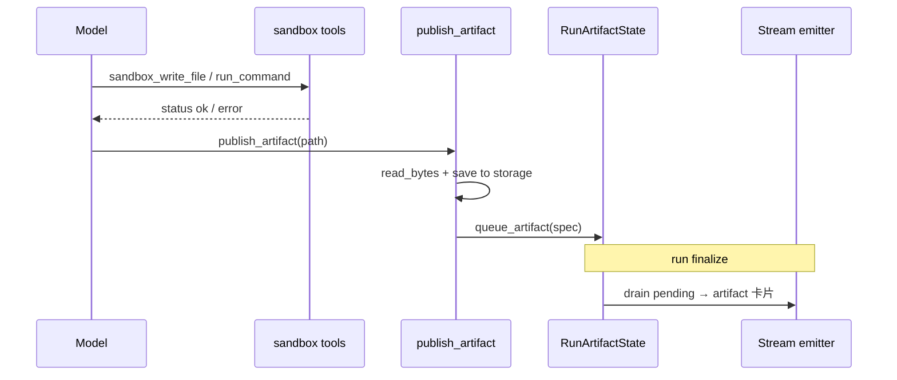

# E2B Sandbox 工作方式

> Content Studio 等 agent 在远程 Linux 虚拟机中执行脚本、读写文件、产出 docx/pptx/html 制品。  
> 平台负责 **E2B 生命周期**（创建、复用、超时、失效重建、释放）；agent 通过 **builtin tools** 操作沙箱。

**相关代码**

| 区域 | 路径 |
|------|------|
| 会话缓存 / 失效 | `backend/app/shared/sandbox/e2b_session.py` |
| Content Studio provider | `backend/app/shared/sandbox/providers/content_studio.py` |
| Agent 可见 tools | `backend/app/shared/sandbox/tools.py` |
| 制品发布 | `backend/app/shared/artifacts/publish_tools.py` |
| Run 级 session key | `backend/app/shared/artifacts/context.py` |
| Plugin 挂钩 | `backend/app/shared/artifacts/plugin.py` |
| 配置 | `backend/app/config.py` |
| E2B 镜像模板 | `backend/e2b-templates/content-studio/` |
| 测试 | `backend/tests/test_e2b_session_recovery.py`、`test_content_studio_sandbox_read.py` |

**主要消费者**：`content-studio`（`backend/agents/content-studio/profile.yaml`）

---

## 1. 架构概览


**分层原则**（见 `.cursor/rules/backend-app-layout.mdc`）：

- **E2B 执行基础设施** → `shared/sandbox/`
- **聊天制品卡片**（下载/预览 URL）→ `shared/artifacts/`
- 单 agent 业务逻辑留在 `agent_specific/`；Content Studio 的 skills 在 `backend/agents/content-studio/skills/`

---

## 2. 目录结构

```
backend/app/shared/sandbox/
├── e2b_session.py          # 进程内 sandbox 句柄缓存（按 session key）
├── tools.py                # sandbox_run_command / read / write
├── providers/
│   └── content_studio.py   # E2B 创建、路径校验、重连
└── templates/              # 本地 npm 包清单（非运行时镜像）

backend/e2b-templates/content-studio/   # E2B 自定义镜像构建定义
backend/tests/test_e2b_session_recovery.py
```

当前仅 **一个 provider**：`ContentStudioSandbox`（`name = content_studio_e2b`）。`tools.py` 硬编码 `get_content_studio_sandbox()`；slide-studio 等 agent 若需沙箱，应在 profile `allowed_tools` 中声明同一组工具（provider 路由见 §14）。

---

## 3. 生命周期

### 3.1 Run 开始：绑定 session key

`ArtifactRuntimePlugin.on_run_start` 为特定 agent 初始化制品上下文，并设置 E2B session key：

| Agent slug | E2B namespace | Session key 示例 |
|------------|---------------|------------------|
| `content-studio` | `content-studio` | `content-studio:<chat_uuid>` |
| `napkin-architect` | `None` | `<chat_uuid>` |
| 其他（仅 diagram） | `None` | `<chat_uuid>` |

实现：`init_run_artifact_state(chat_id=..., e2b_namespace=...)` → `set_e2b_session_key(key)`。

> **命名 vs 实际粒度（已知不一致）**  
> Session key 按 **chat** 命名（`content-studio:<chat_uuid>`），暗示"沙箱跟整个对话绑定"。  
> 但 §3.3 的实现是每次 **run** 结束就 `kill()`，实际生命周期粒度是 **run**，不是 chat。  
> 同一 chat 的多轮 run 之间 **不会** 复用 VM；不要假设跨轮追问时工作区文件还在。

### 3.2 懒创建 + 同 run 复用

首次调用任意 sandbox 操作时：

1. `ContentStudioSandbox._acquire()` 读取当前 `session_key`（ContextVar）
2. `acquire_e2b_sandbox()` 查进程内 `_sessions` 字典
3. **命中** → 返回已有句柄，`created=False`
4. **未命中** → 调用 `Sandbox.create(...)` 新建 VM，`created=True`

`SANDBOX_REUSE_SESSION=true`（默认）时，**同一 run 内**多次 `write` / `run_command` 共用同一 VM，避免重复冷启动。

`SANDBOX_REUSE_SESSION=false` 时每次操作都新建 sandbox（仅调试用途）。

**并发安全（已实现）**：`acquire_e2b_sandbox()` 使用 `threading.Lock` + double-check；并发 miss 时只保留一个 VM，多余的会 `kill()` 掉，避免同一 key 建出孤儿沙箱。

**部署假设（当前安全，扩容有风险）**：`_sessions` 是进程内字典。当前 `scripts/start.sh` 以 **单 worker uvicorn** 启动；且同一 run 的全部 tool call 在同一 async 任务内执行，run 内复用可靠。若未来 gunicorn 多 worker 或 K8s 多 pod 水平扩展，且同一 run 的 tool call 可能被路由到不同实例，进程内缓存会失效——需配合 §14 P0 将 `sandbox_id` 存到外部共享存储（见 §12）。

### 3.3 Run 结束：释放（当前：硬 kill）

`ArtifactRuntimePlugin.on_run_end` → `reset_run_artifact_state()`：

1. `release_e2b_session()` — 从缓存移除并 `sandbox.kill()`
2. `set_e2b_session_key(None)`

**注意**：

- 单次 run **内部**不会自动 release；只有整次 run 结束才清理。
- 当前使用 `.kill()`，沙箱进入 E2B `Killed` 终态，**无法 resume**。这与 E2B 官方推荐的跨轮 `pause` / `resume` 范式不同（见 §14 P0）。
- **跨 run 工作区不保留**：下一轮用户追问（如"再改一下上一节"）时 VM 是冷启动的空环境，agent 必须从对话历史重建脚本和中间文件。

### 3.4 超时与失效重建（stale recovery）

E2B VM 在 **空闲超时** 后会被云端销毁（默认与 `SANDBOX_TIMEOUT_SECONDS` 一致，当前 **180 秒**）。若进程内仍缓存已死句柄，后续调用会失败，典型错误：

- `connection to sandbox ... ended before the stream completed`
- `The sandbox was not found`
- `sandbox timeout`

**修复机制**（`ContentStudioSandbox._call_with_reconnect`）：

1. 捕获异常，用 `is_e2b_stale_sandbox_error()` 判断是否为 stale
2. `invalidate_e2b_sandbox(session_key)` — 清缓存并 kill 旧句柄
3. **重试一次**（重新 `acquire` → 新建 VM）

适用于：`run_command`、`read_file`、`write_file`、`read_bytes`（`publish_artifact` 路径）。

**重要语义**：重建后的 VM 是 **空环境**。模板内预置的 `/home/user/content-studio/skills/` 仍在镜像里，但本轮 run 中 agent 自行写入的工作区文件 **不会保留**，需重新 `sandbox_write_file` 或重跑脚本。

**已知局限（本次不 fix，见 §14 P2）**：

- 仅重试 **一次**，无 backoff；E2B 侧限流/配额打满时，立即重试大概率仍失败。
- 未区分「旧句柄失效」与「新建 VM 失败」两种错误模式，不利于可观测性和用户提示。
- `is_e2b_stale_sandbox_error()` 含宽泛的 `"not found"` 子串，可能把文件不存在误判为 sandbox 失效，触发不必要的 VM 重建（待收窄匹配模式）。

---

## 4. Agent 工具

工具在 `builtin_registry.py` 注册；**仅当** agent `profile.yaml` 的 `allowed_tools` 列出时，`AllowedToolsMiddleware` 才放行。

### 4.1 Sandbox I/O

| 工具 | 作用 | 默认限制 |
|------|------|----------|
| `sandbox_run_command` | 在 VM 内执行 shell | stdout/stderr 各保留 **尾部 8000** 字符返回给模型 |
| `sandbox_read_file` | 读 UTF-8 文本 | 单文件最多 **500KB**（provider）；返回给模型最多 **12000** 字符（**头部**截断） |
| `sandbox_write_file` | 写 UTF-8 文本 | 无显式上限（受 E2B 与命令超时约束） |

默认工作目录：`/home/user/content-studio`。

工具层将异常转为 `{"status":"error","message":"..."}`，**不**终止 agent loop。

**截断策略说明**（`tools.py`）：

- `sandbox_run_command`：`stdout[-8000:]`、`stderr[-8000:]` — **保留尾部**，构建/编译报错的关键信息通常在输出末尾，当前实现正确。
- `sandbox_read_file`：`content[:12000]` — 保留头部；对大 reference 文件可能截掉尾部，优先级低于 run 生命周期问题。

### 4.2 制品发布

| 工具 | 作用 |
|------|------|
| `publish_artifact` | 从沙箱读二进制成品 → 落库 → 排队 SSE 制品卡片 |

流程：

1. `read_bytes(path)` — 二进制安全读取（`format="bytes"`），校验 docx/pptx ZIP 头
2. `build_content_studio_artifact_spec()` — 按扩展名映射 `kind` / `format`，写入 `shared/artifacts/storage`
3. `RunArtifactState.queue_artifact()` — 去重后进入 pending，run 结束时由 stream emitter 下发

单文件发布上限：**20MB**（`read_bytes` 默认 `max_bytes`）。

已发布的制品持久化在平台 storage 中（有 download URL），但 **不会自动回灌** 到下一轮 run 的沙箱工作区——跨轮改稿目前依赖模型从对话历史重建，或等 §14 P0/P1 落地。

### 4.3 Skills 与沙箱的关系

Content Studio 有两条 skill 访问路径，**不要混用**：

| 路径 | 机制 | 用途 |
|------|------|------|
| 平台 skills | `load_skill` / `read_skill_resource`（`skills_dir` 自动放行） | 读 **后端仓库** 内 `backend/agents/content-studio/skills/` |
| 沙箱镜像 skills | `sandbox_read_file` / `sandbox_run_command` | 读/跑 **E2B 镜像内** `/home/user/content-studio/skills/<skill>/` 的 scripts、references、assets |

镜像在构建时 bake 了 docx/pptx/html-slides 的 scripts 与品牌资源（见 `e2b-templates/content-studio/README.md`）。  
`system_prompt.md` 要求生成类任务：**先 `load_skill`，再在沙箱内执行脚本**。

> `run_skill_script` **不是**平台 builtin；若 agent 调用会触发 `Tool not allowed`。应使用 `sandbox_run_command` 执行 skill 目录下的脚本。弱指令遵从度的模型可能反复误调此工具——需专项 case 测试（见 §14 P5）。

---

## 5. 路径与安全

工作区根目录：

```
/home/user/content-studio
/home/user/content-studio/skills/   # 允许读取 skill 镜像内容
```

`ContentStudioSandbox.resolve_path()`：

- 相对路径解析到 `WORK_DIR` 下
- 拒绝 `..` 路径穿越
- 仅允许 `_ALLOWED_ROOTS` 下的路径

**文本 vs 二进制**：

- `sandbox_read_file` — 仅 UTF-8 文本；二进制会报错并提示用 `publish_artifact`
- `publish_artifact` / `read_bytes` — 二进制；docx/pptx 校验 `PK` ZIP 魔数

**网络出口（文档遗漏，待评估）**：

- 当前 `Sandbox.create()` **未配置**网络策略；E2B VM 默认可能具备互联网访问。
- 结合用户上传文档被注入恶意指令的风险，被投毒的 docx/PDF 理论上可能诱导 agent 在沙箱内执行 `curl`/`wget` 外传数据或探测内网。
- **本次不 fix**；上线前需明确 E2B 套餐的网络策略（出网白名单 / 完全隔离），并在模板或 SDK 参数中配置。见 §14。

---

## 6. 配置

| 环境变量 | 默认值 | 说明 |
|----------|--------|------|
| `E2B_API_KEY` | — | **必填**；无则 `ContentStudioSandboxError` |
| `E2B_CONTENT_STUDIO_TEMPLATE` | `okf-content-studio:1.14` | E2B 模板 alias[:tag] |
| `SANDBOX_TIMEOUT_SECONDS` | `180` | 传给 `Sandbox.create(timeout=...)`；单命令 `commands.run` 默认超时同值；最小 30 |
| `SANDBOX_REUSE_SESSION` | `true` | 同 run 内复用 VM；关闭则每次新建 |

示例（`.env`）：

```bash
E2B_API_KEY=e2b_...
# E2B_CONTENT_STUDIO_TEMPLATE=okf-content-studio:1.14
# SANDBOX_TIMEOUT_SECONDS=600    # 长 docx/pptx 构建可调大
# SANDBOX_REUSE_SESSION=true
```

---

## 7. E2B 模板镜像

模板源码：`backend/e2b-templates/content-studio/`。

预装工具链（摘要）：

| 层 | 内容 |
|----|------|
| apt | LibreOffice、Poppler、Pandoc、Python3、gcc |
| pip | markitdown、Pillow、lxml 等 |
| npm global | pptxgenjs、docx、react、sharp 等 |
| 工作区 | skill scripts / references / brand assets |

构建（需 `E2B_API_KEY`）：

```bash
cd backend
npm run e2b:build-content-studio-template
```

详见 `backend/e2b-templates/README.md` 与 `content-studio/README.md`。

---

## 8. 典型工作流（Content Studio）

以生成 docx 为例：

```
1. load_skill("docx")                    # 平台侧读 SKILL.md / 主题
2. sandbox_read_file(".../skills/docx/...")  # 可选：读镜像内 reference
3. sandbox_write_file("build.js", ...)   # 写入构建脚本到工作区
4. sandbox_run_command("node build.js")  # 执行；失败则读 stderr 修复重试
5. publish_artifact("/home/user/content-studio/out.docx", title="...")
```

**同 run 内迭代**：步骤 3–4 可反复调用，文件保留在 VM 中，直到 run 结束或 VM 超时重建。

**跨 run 改稿（当前限制）**：

- 用户在新一轮 run 中说"再改一下上一节"时，上一轮 run 结束已 `kill()` VM，工作区为空。
- Agent 必须从对话历史中的 `sandbox_write_file` / `sandbox_run_command` 记录重建脚本；若 memory compaction 裁掉了这些内容，改稿容易失败或产出不一致。
- 对 Content Studio 这类 docx/pptx 很少一次成型的场景，这是 **核心产品体验缺口**（见 §14 P0）。

---

## 9. 错误处理速查

| 现象 | 原因 | 处理 |
|------|------|------|
| `E2B_API_KEY is not configured` | 未配置密钥 | 设置 `.env` |
| `sandbox timeout` / `sandbox was not found` | VM 已死，旧句柄 | 平台自动 invalidate + 重试一次；agent 需重写工作区文件 |
| `Tool not allowed: sandbox_*` | profile 未声明 | 在 `allowed_tools` 加入对应工具名 |
| `File is binary`（read_file） | 对 docx 用了 read_file | 改用 `publish_artifact` |
| `Deliverable looks corrupted` | 读到的不是 ZIP | 检查构建脚本是否写完整 |
| 命令 exit_code ≠ 0 | 脚本错误 | 读 stderr（尾部 8000 字符），修复后重跑（工具返回 `status: error` 不杀 run） |

---

## 10. 与制品系统的衔接



`ArtifactRuntimePlugin` 同时为 diagram / content 类 agent 提供 `RunArtifactState`；sandbox 与 diagram 共用同一 context 变量，但 E2B namespace 仅 content-studio 使用带前缀的 key。

---

## 11. 测试

| 文件 | 覆盖 |
|------|------|
| `test_e2b_session_recovery.py` | stale 错误识别、invalidate、重连重试 |
| `test_content_studio_sandbox_read.py` | 二进制 read、`format=bytes`、ZIP 头校验 |

运行：

```bash
cd backend
python3 -m pytest tests/test_e2b_session_recovery.py tests/test_content_studio_sandbox_read.py -q
```

---

## 12. 运维与部署

1. **长任务**：将 `SANDBOX_TIMEOUT_SECONDS` 提高到 600+（视 docx/pptx 复杂度）。
2. **超时后**：依赖自动重建；提示 agent 重新写入中间文件（平台不持久化沙箱工作区）。
3. **模板升级**：改 Dockerfile / `template.ts` → 重新 build → 更新 `E2B_CONTENT_STUDIO_TEMPLATE` tag。
4. **成本**：`SANDBOX_REUSE_SESSION=true` 减少同 run 内冷启动；run 结束当前会 `kill()`（见 §14 改为 pause 后可降跨轮成本）。
5. **单 worker 假设**：当前 `scripts/start.sh` 启动单进程 uvicorn；多 worker / 多 pod 部署前必须先完成 §14 P0（外部 `sandbox_id` 存储），否则 `_sessions` 进程内缓存不可靠。

---

## 13. 设计评审摘要（2025-03）

对当前实现的架构评审结论，供后续迭代参考。

### 13.1 扎实的设计

| 项 | 说明 |
|----|------|
| E2B + 懒创建 + run 内复用 | 业界主流范式，与 e2b/Daytona/code-interpreter 类产品一致 |
| 工具异常 → `status:error` 不杀 run | agent loop 可自我修复重试 |
| docx/pptx ZIP 魔数校验 | `read_bytes` 防止发布损坏产物 |
| 平台 skills vs 镜像 skills 分离 | `load_skill`（仓库）与 `sandbox_*`（VM）职责清晰 |
| acquire 并发锁 | `threading.Lock` + double-check，避免同 key 重复建 VM |
| stderr 尾部截断 | `stdout[-8000:]` / `stderr[-8000:]`，保留构建报错关键信息 |

### 13.2 已知隐患（本地先不 fix）

| 项 | 现状 | 风险 | 缓解 |
|----|------|------|------|
| 进程内 `_sessions` | 单 worker 下安全 | 多实例扩容后跨进程 miss | 保持单 worker；扩容前做 P0 |
| stale 重试一次、无 backoff | 已实现 | E2B 限流/抖动时易失败 | P2 |
| `is_e2b_stale_sandbox_error` 宽泛 `"not found"` | 已实现 | 文件不存在误判为 stale | P2 收窄匹配 |
| 网络出口未限制 | 未配置 | 投毒文档 + curl 外传风险 | 安全评估后配置 E2B 网络策略 |
| Provider 硬编码 | `tools.py` → content_studio | 第二个沙箱 agent 需复制逻辑 | P4 |
| 国内模型自纠错 | 未专项测试 | agentic loop 成功率未知 | P5 case 集 |

### 13.3 核心缺口：生命周期粒度

```mermaid
flowchart LR
    subgraph 当前实现
        R1["Run 1"] --> K1["kill()"]
        R2["Run 2"] --> C1["create() 冷启动"]
    end

    subgraph 目标（E2B 推荐）
        R3["Run 1"] --> P["pause() + 存 sandbox_id"]
        R4["Run 2"] --> RS["resume(id)"]
        RS -->|失效/超时| C2["create()"]
        IDLE["Chat 闲置 N 天"] --> K2["kill() 终态"]
    end
```

- Session key 命名暗示 chat 粒度，实际 run 结束即 kill → **命名与语义不一致**。
- Content Studio 跨轮改稿是核心场景，但每轮都冷启动 + 依赖模型记忆重建 → **产品体验缺口**。
- E2B 官方推荐跨轮 `pause` / `resume`（约 1s 恢复、暂停期按存储计费），当前未采用。

---

## 14. 改进路线图

按优先级排列；**P0 为本次计划 fix 的核心项**。

### P0 — 跨 run 沙箱生命周期（pause/resume）

**目标**：同一 chat 多轮 run 之间保留沙箱工作区文件，支撑"再改一下上一节"类改稿。

| 改动 | 说明 |
|------|------|
| `release` → `pause` | `on_run_end` 调用 `sandbox.pause({ keepMemory: false })` 而非 `kill()`；Content Studio 只需保留磁盘文件，不需跨轮内存状态 |
| 持久化 `sandbox_id` | 存 `chats.session_state`（已有 JSONB 字段），结构示例：`{ "e2b": { "sandbox_id": "...", "namespace": "content-studio", "paused_at": "..." } }` |
| `_acquire` 改造 | 先查 DB/Redis 中的 `sandbox_id` → `Sandbox.resume(id)`；resume 失败（超时/已 kill）再 `Sandbox.create()` |
| Chat 终态清理 | chat 闲置超过 N 天、或用户删除对话时，调用 `kill()` 释放暂停沙箱，避免存储成本无限堆积 |
| E2B `on_timeout` 兜底 | `Sandbox.create(on_timeout={ action: "pause" })` 防止应用层漏调 pause 时 VM 被硬删 |
| 稳定性测试 | 连续 5–6 轮 pause→resume→写文件，验证 E2B SDK 多次 pause/resume 的已知稳定性问题 |

**与多实例部署的关系**：pause/resume 必须配合外部 `sandbox_id` 存储；进程内 `_sessions` 仅作同 run 内的句柄缓存，不再承担跨 run 状态。

### P1 — 跨 run 改稿降级方案（P0 落地前的过渡）

| 项 | 说明 |
|----|------|
| 已发布产物回灌 | 新 run 开始时，将上一轮 `publish_artifact` 存的 docx/pptx 写回 VM 工作区 |
| Memory 保护 | compaction 时保留 `sandbox_write_file` / `sandbox_run_command` 的完整内容，避免脚本被裁掉 |
| 文档诚实化 | 已在 §3.1 / §8 标明当前限制 |

### P2 — 重试与可观测性

- stale 重建：可配置重试次数 + 简单 backoff（如 1s / 2s / 4s）。
- 区分错误类型：`StaleSandboxError`（invalidate + 重建）vs `CreateSandboxError`（限流/配额，给用户明确提示）。
- 收窄 `is_e2b_stale_sandbox_error()`：移除宽泛 `"not found"`，改为 E2B 特定模式。
- 结构化日志：`sandbox_created` / `sandbox_resumed` / `sandbox_stale_retry` / `sandbox_create_failed`。

### P3 — 安全与文档

- 明确 E2B VM 网络策略并在模板/SDK 中配置。
- 评估用户上传文档 + 沙箱出网的组合风险。

### P4 — Provider 路由

- 在 `profile.yaml` 增加 `sandbox_provider`（或等价字段），`tools.py` 按配置路由到 `shared/sandbox/providers/` 下的实现。
- 避免每新增一个沙箱类 agent 就复制 `ContentStudioSandbox` 全套 session/重连/发布逻辑。

### P5 — 模型可靠性评估

针对 DeepSeek / Qwen / MiniMax 等国内模型，跑固定 case 集度量：

- `load_skill` → 写脚本 → 跑失败 → 读 stderr → 修复重试 的成功率。
- 误调 `run_skill_script` 后能否切换到 `sandbox_run_command`。
- LibreOffice / pptx 构建报错的自纠错能力。

---

## 15. 其他扩展

- 新文档类 agent：复用 `okf-content-studio` 模板 + 同一组 sandbox/publish tools。
- `sandbox_read_file` 大文件截断：考虑 head+tail 或 tail-only（优先级低）。
