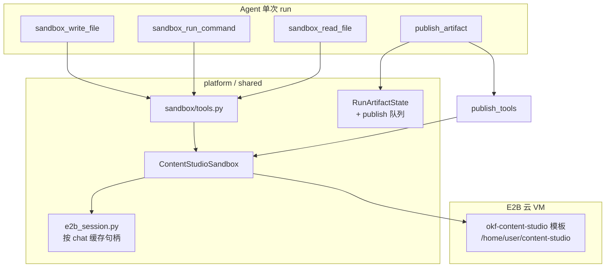
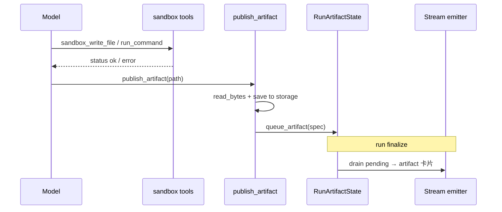

# E2B Sandbox 工作方式

> Content Studio 等 agent 在远程 Linux 虚拟机中执行脚本、读写文件、产出 docx/pptx/html 制品。  
> 平台负责 **E2B 生命周期**（创建、复用、超时、失效重建、释放）；agent 通过 **builtin tools** 操作沙箱。

**相关代码**

| 区域 | 路径 |
|------|------|
| 会话缓存 / 失效 | `backend/app/shared/sandbox/e2b_session.py` |
| Content Studio provider | `backend/app/shared/sandbox/providers/content_studio.py` |
| Agent 可见 tools | `backend/app/shared/sandbox/tools.py` |
| 制品发布 | `backend/app/shared/artifacts/publish_tools.py` |
| Run 级 session key | `backend/app/shared/artifacts/context.py` |
| Plugin 挂钩 | `backend/app/shared/artifacts/plugin.py` |
| 配置 | `backend/app/config.py` |
| E2B 镜像模板 | `backend/e2b-templates/content-studio/` |
| 测试 | `backend/tests/test_e2b_session_recovery.py`、`test_content_studio_sandbox_read.py` |

**主要消费者**：`content-studio`（`backend/agents/content-studio/profile.yaml`）

---

## 1. 架构概览



**分层原则**（见 `.cursor/rules/backend-app-layout.mdc`）：

- **E2B 执行基础设施** → `shared/sandbox/`
- **聊天制品卡片**（下载/预览 URL）→ `shared/artifacts/`
- 单 agent 业务逻辑留在 `agent_specific/`；Content Studio 的 skills 在 `backend/agents/content-studio/skills/`

---

## 2. 目录结构

```
backend/app/shared/sandbox/
├── e2b_session.py          # 进程内 sandbox 句柄缓存（按 session key）
├── tools.py                # sandbox_run_command / read / write
├── providers/
│   └── content_studio.py   # E2B 创建、路径校验、重连
└── templates/              # 本地 npm 包清单（非运行时镜像）

backend/e2b-templates/content-studio/   # E2B 自定义镜像构建定义
backend/tests/test_e2b_session_recovery.py
```

当前仅 **一个 provider**：`ContentStudioSandbox`（`name = content_studio_e2b`）。slide-studio 等 agent 若需沙箱，应在 profile `allowed_tools` 中声明同一组工具。

---

## 3. 生命周期

### 3.1 Run 开始：绑定 session key

`ArtifactRuntimePlugin.on_run_start` 为特定 agent 初始化制品上下文，并设置 E2B session key：

| Agent slug | E2B namespace | Session key 示例 |
|------------|---------------|------------------|
| `content-studio` | `content-studio` | `content-studio:<chat_uuid>` |
| `napkin-architect` | `None` | `<chat_uuid>` |
| 其他（仅 diagram） | `None` | `<chat_uuid>` |

实现：`init_run_artifact_state(chat_id=..., e2b_namespace=...)` → `set_e2b_session_key(key)`。

### 3.2 懒创建 + 同 run 复用

首次调用任意 sandbox 操作时：

1. `ContentStudioSandbox._acquire()` 读取当前 `session_key`
2. `acquire_e2b_sandbox()` 查进程内 `_sessions` 字典
3. **命中** → 返回已有句柄，`created=False`
4. **未命中** → 调用 `Sandbox.create(...)` 新建 VM，`created=True`

`SANDBOX_REUSE_SESSION=true`（默认）时，同一 chat run 内多次 `write` / `run_command` 共用同一 VM，避免重复冷启动。

`SANDBOX_REUSE_SESSION=false` 时每次操作都新建 sandbox（仅调试用途）。

### 3.3 Run 结束：释放

`ArtifactRuntimePlugin.on_run_end` → `reset_run_artifact_state()`：

1. `release_e2b_session()` — 从缓存移除并 `sandbox.kill()`
2. `set_e2b_session_key(None)`

**注意**：单次 run **内部**不会自动 release；只有整次 run 结束才清理。

### 3.4 超时与失效重建（stale recovery）

E2B VM 在 **空闲超时** 后会被云端销毁（默认与 `SANDBOX_TIMEOUT_SECONDS` 一致，当前 **180 秒**）。若进程内仍缓存已死句柄，后续调用会失败，典型错误：

- `connection to sandbox ... ended before the stream completed`
- `The sandbox was not found`
- `sandbox timeout`

**修复机制**（`ContentStudioSandbox._call_with_reconnect`）：

1. 捕获异常，用 `is_e2b_stale_sandbox_error()` 判断是否为 stale
2. `invalidate_e2b_sandbox(session_key)` — 清缓存并 kill 旧句柄
3. **重试一次**（重新 `acquire` → 新建 VM）

适用于：`run_command`、`read_file`、`write_file`、`read_bytes`（`publish_artifact` 路径）。

**重要语义**：重建后的 VM 是 **空环境**。模板内预置的 `/home/user/content-studio/skills/` 仍在镜像里，但本轮 run 中 agent 自行写入的工作区文件 **不会保留**，需重新 `sandbox_write_file` 或重跑脚本。

---

## 4. Agent 工具

工具在 `builtin_registry.py` 注册；**仅当** agent `profile.yaml` 的 `allowed_tools` 列出时，`AllowedToolsMiddleware` 才放行。

### 4.1 Sandbox I/O

| 工具 | 作用 | 默认限制 |
|------|------|----------|
| `sandbox_run_command` | 在 VM 内执行 shell | stdout/stderr 各截断 **8000** 字符返回给模型 |
| `sandbox_read_file` | 读 UTF-8 文本 | 单文件最多 **500KB**（provider）；返回给模型最多 **12000** 字符 |
| `sandbox_write_file` | 写 UTF-8 文本 | 无显式上限（受 E2B 与命令超时约束） |

默认工作目录：`/home/user/content-studio`。

工具层将异常转为 `{"status":"error","message":"..."}`，**不**终止 agent loop。

### 4.2 制品发布

| 工具 | 作用 |
|------|------|
| `publish_artifact` | 从沙箱读二进制成品 → 落库 → 排队 SSE 制品卡片 |

流程：

1. `read_bytes(path)` — 二进制安全读取（`format="bytes"`），校验 docx/pptx ZIP 头
2. `build_content_studio_artifact_spec()` — 按扩展名映射 `kind` / `format`，写入 `shared/artifacts/storage`
3. `RunArtifactState.queue_artifact()` — 去重后进入 pending，run 结束时由 stream emitter 下发

单文件发布上限：**20MB**（`read_bytes` 默认 `max_bytes`）。

### 4.3 Skills 与沙箱的关系

Content Studio 有两条 skill 访问路径，**不要混用**：

| 路径 | 机制 | 用途 |
|------|------|------|
| 平台 skills | `load_skill` / `read_skill_resource`（`skills_dir` 自动放行） | 读 **后端仓库** 内 `backend/agents/content-studio/skills/` |
| 沙箱镜像 skills | `sandbox_read_file` / `sandbox_run_command` | 读/跑 **E2B 镜像内** `/home/user/content-studio/skills/<skill>/` 的 scripts、references、assets |

镜像在构建时 bake 了 docx/pptx/html-slides 的 scripts 与品牌资源（见 `e2b-templates/content-studio/README.md`）。  
`system_prompt.md` 要求生成类任务：**先 `load_skill`，再在沙箱内执行脚本**。

> `run_skill_script` **不是**平台 builtin；若 agent 调用会触发 `Tool not allowed`。应使用 `sandbox_run_command` 执行 skill 目录下的脚本。

---

## 5. 路径与安全

工作区根目录：

```
/home/user/content-studio
/home/user/content-studio/skills/   # 允许读取 skill 镜像内容
```

`ContentStudioSandbox.resolve_path()`：

- 相对路径解析到 `WORK_DIR` 下
- 拒绝 `..` 路径穿越
- 仅允许 `_ALLOWED_ROOTS` 下的路径

**文本 vs 二进制**：

- `sandbox_read_file` — 仅 UTF-8 文本；二进制会报错并提示用 `publish_artifact`
- `publish_artifact` / `read_bytes` — 二进制；docx/pptx 校验 `PK` ZIP 魔数

---

## 6. 配置

| 环境变量 | 默认值 | 说明 |
|----------|--------|------|
| `E2B_API_KEY` | — | **必填**；无则 `ContentStudioSandboxError` |
| `E2B_CONTENT_STUDIO_TEMPLATE` | `okf-content-studio:1.14` | E2B 模板 alias[:tag] |
| `SANDBOX_TIMEOUT_SECONDS` | `180` | 传给 `Sandbox.create(timeout=...)`；单命令 `commands.run` 默认超时同值；最小 30 |
| `SANDBOX_REUSE_SESSION` | `true` | 同 chat run 复用 VM；关闭则每次新建 |

示例（`.env`）：

```bash
E2B_API_KEY=e2b_...
# E2B_CONTENT_STUDIO_TEMPLATE=okf-content-studio:1.14
# SANDBOX_TIMEOUT_SECONDS=600    # 长 docx/pptx 构建可调大
# SANDBOX_REUSE_SESSION=true
```

---

## 7. E2B 模板镜像

模板源码：`backend/e2b-templates/content-studio/`。

预装工具链（摘要）：

| 层 | 内容 |
|----|------|
| apt | LibreOffice、Poppler、Pandoc、Python3、gcc |
| pip | markitdown、Pillow、lxml 等 |
| npm global | pptxgenjs、docx、react、sharp 等 |
| 工作区 | skill scripts / references / brand assets |

构建（需 `E2B_API_KEY`）：

```bash
cd backend
npm run e2b:build-content-studio-template
```

详见 `backend/e2b-templates/README.md` 与 `content-studio/README.md`。

---

## 8. 典型工作流（Content Studio）

以生成 docx 为例：

```
1. load_skill("docx")                    # 平台侧读 SKILL.md / 主题
2. sandbox_read_file(".../skills/docx/...")  # 可选：读镜像内 reference
3. sandbox_write_file("build.js", ...)   # 写入构建脚本到工作区
4. sandbox_run_command("node build.js")  # 执行；失败则读 stderr 修复重试
5. publish_artifact("/home/user/content-studio/out.docx", title="...")
```

多步迭代（改稿）依赖 **同 run 内 session 复用**：步骤 3–4 可反复调用，文件保留在 VM 中，直到 run 结束或 VM 超时重建。

---

## 9. 错误处理速查

| 现象 | 原因 | 处理 |
|------|------|------|
| `E2B_API_KEY is not configured` | 未配置密钥 | 设置 `.env` |
| `sandbox timeout` / `sandbox was not found` | VM 已死，旧句柄 | 平台自动 invalidate + 重试一次；agent 需重写工作区文件 |
| `Tool not allowed: sandbox_*` | profile 未声明 | 在 `allowed_tools` 加入对应工具名 |
| `File is binary`（read_file） | 对 docx 用了 read_file | 改用 `publish_artifact` |
| `Deliverable looks corrupted` | 读到的不是 ZIP | 检查构建脚本是否写完整 |
| 命令 exit_code ≠ 0 | 脚本错误 | 读 stderr，修复后重跑（工具返回 `status: error` 不杀 run） |

---

## 10. 与制品系统的衔接



`ArtifactRuntimePlugin` 同时为 diagram / content 类 agent 提供 `RunArtifactState`；sandbox 与 diagram 共用同一 context 变量，但 E2B namespace 仅 content-studio 使用带前缀的 key。

---

## 11. 测试

| 文件 | 覆盖 |
|------|------|
| `test_e2b_session_recovery.py` | stale 错误识别、invalidate、重连重试 |
| `test_content_studio_sandbox_read.py` | 二进制 read、`format=bytes`、ZIP 头校验 |

运行：

```bash
cd backend
python3 -m pytest tests/test_e2b_session_recovery.py tests/test_content_studio_sandbox_read.py -q
```

---

## 12. 运维建议

1. **长任务**：将 `SANDBOX_TIMEOUT_SECONDS` 提高到 600+（视 docx/pptx 复杂度）。
2. **超时后**：依赖自动重建；提示 agent 重新写入中间文件（平台不持久化沙箱工作区）。
3. **模板升级**：改 Dockerfile / `template.ts` → 重新 build → 更新 `E2B_CONTENT_STUDIO_TEMPLATE` tag。
4. **成本**：`SANDBOX_REUSE_SESSION=true` 减少冷启动；run 结束务必 release（已实现于 plugin）。

---

## 13. 未来扩展

- 新文档类 agent：复用 `okf-content-studio` 模板 + 同一组 sandbox/publish tools。
- 新 provider：在 `shared/sandbox/providers/` 增加实现，tools 层按配置路由（当前未做，硬编码 content_studio）。
- 沙箱工作区持久化跨 run：未实现；需独立存储设计。
