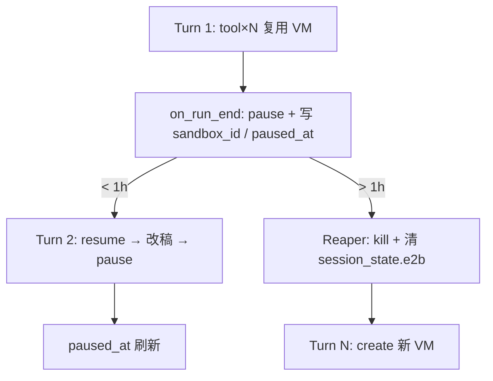
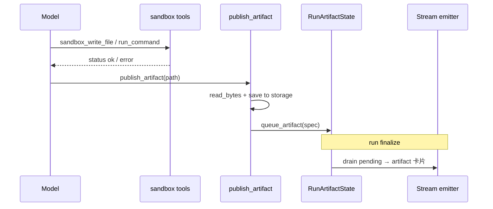
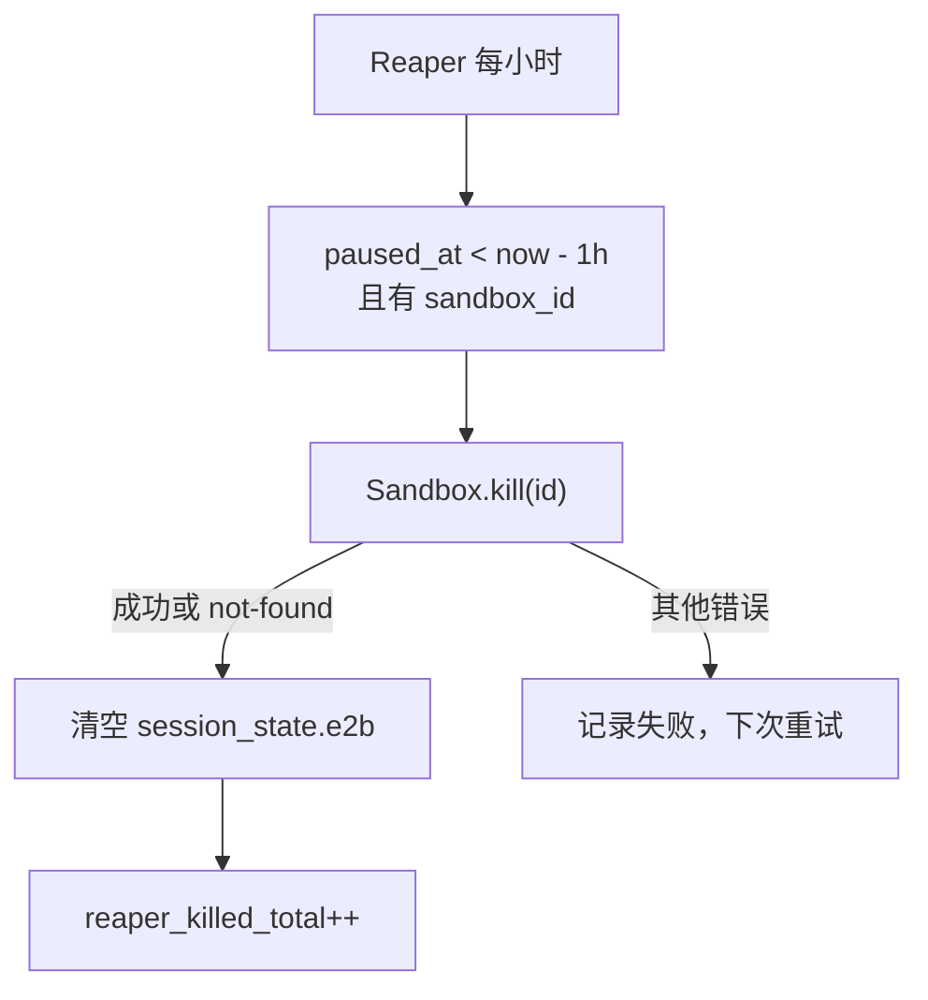

# E2B Sandbox 工作方式

> Content Studio 等 agent 在远程 Linux 虚拟机中执行脚本、读写文件、产出 docx/pptx/html 制品。  
> 平台负责 **E2B 生命周期**（创建、复用、超时、失效重建、释放）；agent 通过 **builtin tools** 操作沙箱。

**相关代码**

| 区域 | 路径 |
|------|------|
| 会话缓存 / 失效 | `backend/app/shared/sandbox/e2b_session.py` |
| Content Studio provider | `backend/app/shared/sandbox/providers/content_studio.py` |
| Agent 可见 tools | `backend/app/shared/sandbox/tools.py` |
| 制品发布 | `backend/app/shared/artifacts/publish_tools.py` |
| Run 级 session key | `backend/app/shared/artifacts/context.py` |
| Plugin 挂钩 | `backend/app/shared/artifacts/plugin.py` |
| 配置 | `backend/app/config.py` |
| E2B 镜像模板 | `backend/e2b-templates/content-studio/` |
| 测试 | `backend/tests/test_e2b_session_recovery.py`、`test_content_studio_sandbox_read.py` |

**主要消费者**：`content-studio`（`backend/agents/content-studio/profile.yaml`）

---

## 1. 架构概览


**分层原则**（见 `.cursor/rules/backend-app-layout.mdc`）：

- **E2B 执行基础设施** → `shared/sandbox/`
- **聊天制品卡片**（下载/预览 URL）→ `shared/artifacts/`
- 单 agent 业务逻辑留在 `agent_specific/`；Content Studio 的 skills 在 `backend/agents/content-studio/skills/`

---

## 2. 目录结构

```
backend/app/shared/sandbox/
├── e2b_session.py          # 进程内 sandbox 句柄缓存（按 session key）
├── tools.py                # sandbox_run_command / read / write
├── providers/
│   └── content_studio.py   # E2B 创建、路径校验、重连
└── templates/              # 本地 npm 包清单（非运行时镜像）

backend/e2b-templates/content-studio/   # E2B 自定义镜像构建定义
backend/tests/test_e2b_session_recovery.py
```

当前仅 **一个 provider**：`ContentStudioSandbox`（`name = content_studio_e2b`）。`tools.py` 硬编码 `get_content_studio_sandbox()`；slide-studio 等 agent 若需沙箱，应在 profile `allowed_tools` 中声明同一组工具（provider 路由见 §14）。

---

## 3. 生命周期

### 3.1 Run 开始：绑定 session key

`ArtifactRuntimePlugin.on_run_start` 为特定 agent 初始化制品上下文，并设置 E2B session key：

| Agent slug | E2B namespace | Session key 示例 |
|------------|---------------|------------------|
| `content-studio` | `content-studio` | `content-studio:<chat_uuid>` |
| `napkin-architect` | `None` | `<chat_uuid>` |
| 其他（仅 diagram） | `None` | `<chat_uuid>` |

实现：`init_run_artifact_state(chat_id=..., e2b_namespace=...)` → `set_e2b_session_key(key)`。

> **命名 vs 实际粒度**  
> Session key 按 **chat** 命名（`content-studio:<chat_uuid>`）。**当前实现**每次 run 结束 `kill()`，key 名虽为 chat 但实际不跨 run 存活。  
> **目标实现**（§3.5）下 key 与 chat 绑定一致：同一 chat 跨 turn 通过 DB 中的 `sandbox_id` resume；reaper 在 pause 超过 1 小时后 kill。

### 3.2 懒创建 + 同 run 复用

首次调用任意 sandbox 操作时：

1. `ContentStudioSandbox._acquire()` 读取当前 `session_key`（ContextVar）
2. `acquire_e2b_sandbox()` 查进程内 `_sessions` 字典
3. **命中** → 返回已有句柄，`created=False`
4. **未命中** → 调用 `Sandbox.create(...)` 新建 VM，`created=True`

`SANDBOX_REUSE_SESSION=true`（默认）时，**同一 run 内**多次 `write` / `run_command` 共用同一 VM，避免重复冷启动。

`SANDBOX_REUSE_SESSION=false` 时每次操作都新建 sandbox（仅调试用途）。

**并发安全（已实现）**：`acquire_e2b_sandbox()` 使用 `threading.Lock` + double-check；并发 miss 时只保留一个 VM，多余的会 `kill()` 掉，避免同一 key 建出孤儿沙箱。

**部署假设（当前安全，扩容有风险）**：`_sessions` 是进程内字典。当前 `scripts/start.sh` 以 **单 worker uvicorn** 启动；且同一 run 的全部 tool call 在同一 async 任务内执行，run 内复用可靠。若未来 gunicorn 多 worker 或 K8s 多 pod 水平扩展，且同一 run 的 tool call 可能被路由到不同实例，进程内缓存会失效——需配合 §14 P0 将 `sandbox_id` 存到外部共享存储（见 §12）。

### 3.3 Run 结束：释放（当前：硬 kill → 计划：pause + reaper）

`ArtifactRuntimePlugin.on_run_end` → `reset_run_artifact_state()`：

1. `release_e2b_session()` — 从缓存移除并 `sandbox.kill()`
2. `set_e2b_session_key(None)`

**注意**：

- 单次 run **内部**不会自动 release；只有整次 run 结束才清理。
- 当前使用 `.kill()`，沙箱进入 E2B `Killed` 终态，**无法 resume**。这与 E2B 官方推荐的跨轮 `pause` / `resume` 范式不同。
- **跨 run 工作区不保留**：下一轮用户追问（如"再改一下上一节"）时 VM 是冷启动的空环境，agent 必须从对话历史重建脚本和中间文件。

**计划变更（§3.5 / §14 P0，pause 与 reaper 同批上线）**：见 §3.5。

### 3.4 超时与失效重建（stale recovery）

E2B VM 在 **运行中空闲超时** 后会被云端处理（默认与 `SANDBOX_TIMEOUT_SECONDS` 一致，当前 **180 秒**；目标实现改为 `on_timeout: pause`）。若进程内仍缓存已死句柄，后续调用会失败，典型错误：

- `connection to sandbox ... ended before the stream completed`
- `The sandbox was not found`
- `sandbox timeout`

**修复机制**（`ContentStudioSandbox._call_with_reconnect`）：

1. 捕获异常，用 `is_e2b_stale_sandbox_error()` 判断是否为 stale
2. `invalidate_e2b_sandbox(session_key)` — 清缓存并 kill 旧句柄
3. **重试一次**（重新 `acquire` → 新建 VM）

适用于：`run_command`、`read_file`、`write_file`、`read_bytes`（`publish_artifact` 路径）。

**重要语义**：stale 重建后的 VM 是 **空环境**（同 turn 内 agent 写入的工作区文件丢失）。跨 turn 热工作区依赖 §3.5 的 pause/resume，而非 stale 重建。

**已知局限（见 §14 P2）**：仅重试一次、无 backoff；`is_e2b_stale_sandbox_error()` 的 `"not found"` 匹配过宽。

### 3.5 目标生命周期（已定稿）

**术语**：platform 里 **turn = 一次 run**（用户发一条消息 → agent loop → `on_run_end`）。



| 时机 | 行为 |
|------|------|
| Turn 内（多次 tool call） | 进程内 `_sessions` 复用同一 VM；**不** pause |
| Turn 结束（`on_run_end`） | `pause({ keepMemory: false })` + 写入 `session_state.e2b`（`sandbox_id`、`paused_at`） |
| 下一 turn 开始 / 首次 sandbox 操作 | 读 `sandbox_id` → `Sandbox.connect()` / resume；失败则 `create()` |
| Reaper（每小时） | `paused_at` 距今 **> 1 小时** → `kill()` + 清空 `session_state.e2b` |
| 用户删除对话 | 同步 `kill()`（不等 reaper） |

**热工作区窗口**：pause 后 **1 小时内** resume，工作区脚本与中间文件完整保留，适合连续追问改稿。超过 1 小时 reaper 已 kill，下一 turn 自动 `create()` 冷启动——**不**把已发布 docx/pptx 回灌进沙箱（见 §3.6）。

**E2B 侧 vs 平台侧 TTL**：

| 层级 | 保留策略 |
|------|----------|
| E2B（Hobby 等所有套餐） | 暂停沙箱 **无自动 TTL**，永久保留直至显式 `kill()` |
| 平台 reaper | **1 小时**（`SANDBOX_REAPER_IDLE_HOURS=1`），弥补 E2B 无上限 |

pause 后不占 Hobby「20 并发运行」配额，但占存储快照；1h reaper 控制快照堆积。**不能单独上线 pause 而不带 reaper**（见 §13.4）。

### 3.6 冷启动后如何继续（不做产物回灌）

Reaper kill 或 resume 失败后，平台保证 **`create()` 总能拿到新 VM**；工作区内容靠以下来源恢复，**不**自动把 `publish_artifact` 产物写回沙箱：

| 来源 | 作用 |
|------|------|
| 对话历史 | `sandbox_write_file` / `sandbox_run_command` 记录；模型据此重写构建脚本 |
| `load_skill` + 镜像 skills | 模板、主题、脚本路径仍在 VM 镜像内，可从零重建 |
| 制品卡片（UI） | 已发布 docx/pptx 供用户**下载**；人类可另作附件上传，平台不自动注入 |
| Memory compaction 保护（P1，可选） | 避免历史中的构建脚本被裁掉 |

**为何不做产物回灌**：

1. **Content Studio 主路径是「脚本构建」而非「二进制就地编辑」**——改稿依赖 `build.js` 等源文件，不是直接改 docx 字节流。
2. **制品已在聊天 UI 持久化**——回灌与下载卡片职责重复；用户若要基于旧版继续，可自行上传附件。
3. **多制品歧义**——同一 chat 多次 `publish_artifact` 时，自动选哪一版回灌缺乏明确规则。
4. **实现成本**——二进制写回、路径约定、与 publish 存储耦合，收益低于保护对话历史中的脚本记录。

隔几天回到 session：**一定能 chat**（`create()` 兜底）；**热工作区**仅 1 小时内有效，之外视为新构建轮次。

---

## 4. Agent 工具

工具在 `builtin_registry.py` 注册；**仅当** agent `profile.yaml` 的 `allowed_tools` 列出时，`AllowedToolsMiddleware` 才放行。

### 4.1 Sandbox I/O

| 工具 | 作用 | 默认限制 |
|------|------|----------|
| `sandbox_run_command` | 在 VM 内执行 shell | stdout/stderr 各保留 **尾部 8000** 字符返回给模型 |
| `sandbox_read_file` | 读 UTF-8 文本 | 单文件最多 **500KB**（provider）；返回给模型最多 **12000** 字符（**头部**截断） |
| `sandbox_write_file` | 写 UTF-8 文本 | 无显式上限（受 E2B 与命令超时约束） |

默认工作目录：`/home/user/content-studio`。

工具层将异常转为 `{"status":"error","message":"..."}`，**不**终止 agent loop。

**截断策略说明**（`tools.py`）：

- `sandbox_run_command`：`stdout[-8000:]`、`stderr[-8000:]` — **保留尾部**，构建/编译报错的关键信息通常在输出末尾，当前实现正确。
- `sandbox_read_file`：`content[:12000]` — 保留头部；对大 reference 文件可能截掉尾部，优先级低于 run 生命周期问题。

### 4.2 制品发布

| 工具 | 作用 |
|------|------|
| `publish_artifact` | 从沙箱读二进制成品 → 落库 → 排队 SSE 制品卡片 |

流程：

1. `read_bytes(path)` — 二进制安全读取（`format="bytes"`），校验 docx/pptx ZIP 头
2. `build_content_studio_artifact_spec()` — 按扩展名映射 `kind` / `format`，写入 `shared/artifacts/storage`
3. `RunArtifactState.queue_artifact()` — 去重后进入 pending，run 结束时由 stream emitter 下发

单文件发布上限：**20MB**（`read_bytes` 默认 `max_bytes`）。

已发布的制品持久化在平台 storage 中（聊天 UI 制品卡片可下载），**故意不**自动回灌沙箱——见 §3.6。跨 turn 改稿在 1h 热窗口内靠 resume 保留工作区；超时后靠对话历史 + `load_skill` 重建。

### 4.3 Skills 与沙箱的关系

Content Studio 有两条 skill 访问路径，**不要混用**：

| 路径 | 机制 | 用途 |
|------|------|------|
| 平台 skills | `load_skill` / `read_skill_resource`（`skills_dir` 自动放行） | 读 **后端仓库** 内 `backend/agents/content-studio/skills/` |
| 沙箱镜像 skills | `sandbox_read_file` / `sandbox_run_command` | 读/跑 **E2B 镜像内** `/home/user/content-studio/skills/<skill>/` 的 scripts、references、assets |

镜像在构建时 bake 了 docx/pptx/html-slides 的 scripts 与品牌资源（见 `e2b-templates/content-studio/README.md`）。  
`system_prompt.md` 要求生成类任务：**先 `load_skill`，再在沙箱内执行脚本**。

> `run_skill_script` **不是**平台 builtin；若 agent 调用会触发 `Tool not allowed`。应使用 `sandbox_run_command` 执行 skill 目录下的脚本。弱指令遵从度的模型可能反复误调此工具——需专项 case 测试（见 §14 P5）。

---

## 5. 路径与安全

工作区根目录：

```
/home/user/content-studio
/home/user/content-studio/skills/   # 允许读取 skill 镜像内容
```

`ContentStudioSandbox.resolve_path()`：

- 相对路径解析到 `WORK_DIR` 下
- 拒绝 `..` 路径穿越
- 仅允许 `_ALLOWED_ROOTS` 下的路径

**文本 vs 二进制**：

- `sandbox_read_file` — 仅 UTF-8 文本；二进制会报错并提示用 `publish_artifact`
- `publish_artifact` / `read_bytes` — 二进制；docx/pptx 校验 `PK` ZIP 魔数

**网络出口（文档遗漏，待评估）**：

- 当前 `Sandbox.create()` **未配置**网络策略；E2B VM 默认可能具备互联网访问。
- 结合用户上传文档被注入恶意指令的风险，被投毒的 docx/PDF 理论上可能诱导 agent 在沙箱内执行 `curl`/`wget` 外传数据或探测内网。
- **本次不 fix**；上线前需明确 E2B 套餐的网络策略（出网白名单 / 完全隔离），并在模板或 SDK 参数中配置。见 §14。

---

## 6. 配置

| 环境变量 | 默认值 | 说明 |
|----------|--------|------|
| `E2B_API_KEY` | — | **必填**；无则 `ContentStudioSandboxError` |
| `E2B_CONTENT_STUDIO_TEMPLATE` | `okf-content-studio:1.14` | E2B 模板 alias[:tag] |
| `SANDBOX_TIMEOUT_SECONDS` | `180` | 传给 `Sandbox.create(timeout=...)`；单命令 `commands.run` 默认超时同值；最小 30 |
| `SANDBOX_REUSE_SESSION` | `true` | 同 run 内复用 VM；关闭则每次新建 |

**计划新增（§14 P0-b，与 pause 同批）**：

| 环境变量 | 建议默认 | 说明 |
|----------|----------|------|
| `SANDBOX_REAPER_IDLE_HOURS` | `1` | `paused_at` 超过 N 小时后 reaper `kill()` |
| `SANDBOX_REAPER_INTERVAL` | `3600` | reaper 扫描间隔（秒）；默认每小时扫一次 |
| `SANDBOX_REAPER_BATCH_SIZE` | `50` | 单次扫描处理上限 |

**E2B Hobby 套餐参考限额**（[官方文档](https://e2b.dev/docs/billing)）：

| 项 | Hobby |
|----|-------|
| 并发**运行中**沙箱 | 20 |
| 单次连续运行（不 pause） | 最长 1 小时 |
| 暂停保留 TTL | **无**（E2B 不自动删；靠平台 reaper） |
| 暂停态计算计费 | 否（仅占存储快照） |
| 套餐存储 | 10 GiB |

示例（`.env`）：

```bash
E2B_API_KEY=e2b_...
# E2B_CONTENT_STUDIO_TEMPLATE=okf-content-studio:1.14
# SANDBOX_TIMEOUT_SECONDS=600    # 长 docx/pptx 构建可调大
# SANDBOX_REUSE_SESSION=true
# SANDBOX_REAPER_IDLE_HOURS=1    # P0-b：pause 超 1h 即 kill
# SANDBOX_REAPER_INTERVAL=3600
```

---

## 7. E2B 模板镜像

模板源码：`backend/e2b-templates/content-studio/`。

预装工具链（摘要）：

| 层 | 内容 |
|----|------|
| apt | LibreOffice、Poppler、Pandoc、Python3、gcc |
| pip | markitdown、Pillow、lxml 等 |
| npm global | pptxgenjs、docx、react、sharp 等 |
| 工作区 | skill scripts / references / brand assets |

构建（需 `E2B_API_KEY`）：

```bash
cd backend
npm run e2b:build-content-studio-template
```

详见 `backend/e2b-templates/README.md` 与 `content-studio/README.md`。

---

## 8. 典型工作流（Content Studio）

以生成 docx 为例：

```
1. load_skill("docx")                    # 平台侧读 SKILL.md / 主题
2. sandbox_read_file(".../skills/docx/...")  # 可选：读镜像内 reference
3. sandbox_write_file("build.js", ...)   # 写入构建脚本到工作区
4. sandbox_run_command("node build.js")  # 执行；失败则读 stderr 修复重试
5. publish_artifact("/home/user/content-studio/out.docx", title="...")
```

**同 run 内迭代**：步骤 3–4 可反复调用，文件保留在 VM 中，直到 run 结束或 VM 超时重建。

**跨 turn 改稿（§3.5 目标）**：

| 场景 | 行为 |
|------|------|
| 当前实现 | 每 turn 结束 `kill()`，下一 turn 冷启动 |
| pause 后 **< 1h** | `resume`，工作区脚本/中间文件保留，可连续改稿 |
| pause 后 **> 1h** | reaper 已 kill；下一 turn `create()` 新 VM，模型从对话历史 + `load_skill` 重建（§3.6） |
| 隔几天回来 | 同上；**保证有 sandbox**，不保证热工作区；制品卡片仍可下载 |

P0-a 与 P0-b 必须同批上线（§13.4）。可选 P1：memory compaction 保护 `sandbox_write_file` 记录，降低冷启动后重建失败率。

---

## 9. 错误处理速查

| 现象 | 原因 | 处理 |
|------|------|------|
| `E2B_API_KEY is not configured` | 未配置密钥 | 设置 `.env` |
| `sandbox timeout` / `sandbox was not found` | VM 已死，旧句柄 | 平台自动 invalidate + 重试一次；agent 需重写工作区文件 |
| `Tool not allowed: sandbox_*` | profile 未声明 | 在 `allowed_tools` 加入对应工具名 |
| `File is binary`（read_file） | 对 docx 用了 read_file | 改用 `publish_artifact` |
| `Deliverable looks corrupted` | 读到的不是 ZIP | 检查构建脚本是否写完整 |
| 命令 exit_code ≠ 0 | 脚本错误 | 读 stderr（尾部 8000 字符），修复后重跑（工具返回 `status: error` 不杀 run） |

---

## 10. 与制品系统的衔接



`ArtifactRuntimePlugin` 同时为 diagram / content 类 agent 提供 `RunArtifactState`；sandbox 与 diagram 共用同一 context 变量，但 E2B namespace 仅 content-studio 使用带前缀的 key。

---

## 11. 测试

| 文件 | 覆盖 |
|------|------|
| `test_e2b_session_recovery.py` | stale 错误识别、invalidate、重连重试 |
| `test_content_studio_sandbox_read.py` | 二进制 read、`format=bytes`、ZIP 头校验 |

运行：

```bash
cd backend
python3 -m pytest tests/test_e2b_session_recovery.py tests/test_content_studio_sandbox_read.py -q
```

---

## 12. 运维与部署

1. **长任务**：将 `SANDBOX_TIMEOUT_SECONDS` 提高到 600+（视 docx/pptx 复杂度）。
2. **超时后**：依赖自动重建；提示 agent 重新写入中间文件（平台不持久化沙箱工作区）。
3. **模板升级**：改 Dockerfile / `template.ts` → 重新 build → 更新 `E2B_CONTENT_STUDIO_TEMPLATE` tag。
4. **成本**：`SANDBOX_REUSE_SESSION=true` 减少同 turn 内冷启动。改为 pause 后 1h 内热改稿无需冷启动；reaper 1h kill 控制 Hobby 存储快照（§3.5）。
5. **单 worker 假设**：当前 `scripts/start.sh` 启动单进程 uvicorn；多 worker / 多 pod 部署前必须先完成 §14 P0-a（DB 存 `sandbox_id`），否则 `_sessions` 进程内缓存不可靠。
6. **暂停沙箱监控**（P0-b 上线后）：关注 `sandbox_paused_total` 与 `sandbox_paused_oldest_age_hours`，防止 reaper 故障导致静默累积。

---

## 13. 设计评审摘要（2025-03）

对当前实现的架构评审结论，供后续迭代参考。

### 13.1 扎实的设计

| 项 | 说明 |
|----|------|
| E2B + 懒创建 + run 内复用 | 业界主流范式，与 e2b/Daytona/code-interpreter 类产品一致 |
| 工具异常 → `status:error` 不杀 run | agent loop 可自我修复重试 |
| docx/pptx ZIP 魔数校验 | `read_bytes` 防止发布损坏产物 |
| 平台 skills vs 镜像 skills 分离 | `load_skill`（仓库）与 `sandbox_*`（VM）职责清晰 |
| acquire 并发锁 | `threading.Lock` + double-check，避免同 key 重复建 VM |
| stderr 尾部截断 | `stdout[-8000:]` / `stderr[-8000:]`，保留构建报错关键信息 |

### 13.2 已知隐患（本地先不 fix）

| 项 | 现状 | 风险 | 缓解 |
|----|------|------|------|
| 无 chat 删除 API | 未实现 `DELETE /chats/{id}` | 用户无法主动结束对话；暂停沙箱只能靠 reaper | P0-b 同批新增删除 API + 同步 kill hook |
| Reaper 依赖 `paused_at` | 当前无 pause，无此字段 | 需 P0-a 写入 `session_state.e2b.paused_at` | P0-a + P0-b |
| 进程内 `_sessions` | 单 worker 下安全 | 多实例扩容后跨进程 miss | 保持单 worker；扩容前做 P0-a |
| stale 重试一次、无 backoff | 已实现 | E2B 限流/抖动时易失败 | P2 |
| `is_e2b_stale_sandbox_error` 宽泛 `"not found"` | 已实现 | 文件不存在误判为 stale | P2 收窄匹配 |
| 网络出口未限制 | 未配置 | 投毒文档 + curl 外传风险 | 安全评估后配置 E2B 网络策略 |
| Provider 硬编码 | `tools.py` → content_studio | 第二个沙箱 agent 需复制逻辑 | P4 |
| 国内模型自纠错 | 未专项测试 | agentic loop 成功率未知 | P5 case 集 |

### 13.3 核心缺口：生命周期粒度

```mermaid
flowchart LR
    subgraph 当前实现
        R1["Run 1"] --> K1["kill()"]
        R2["Run 2"] --> C1["create() 冷启动"]
    end

    subgraph 目标（已定稿 §3.5）
        R3["Turn 1"] --> P["pause + sandbox_id"]
        R4["Turn 2 < 1h"] --> RS["resume"]
        RS -->|失效| C2["create()"]
        P -->|"> 1h"| K2["Reaper kill"]
        K2 --> T3["Turn N: create()"]
    end
```

- 当前 run 结束即 kill → 跨 turn 无热工作区。
- 目标：turn 结束 pause、1h 内 resume 改稿；reaper 超 1h kill；冷启动后靠历史重建（不回灌产物，§3.6）。

### 13.4 pause 与 kill 的成本语义差异（清理机制必须同批上线）

| | `kill()`（当前） | `pause()`（目标） |
|---|---|---|
| run 结束后成本 | 归零 | 持续按存储计费（低于运行态，但非零） |
| 忘了清理的后果 | 无害（已销毁） | 暂停沙箱无限累积 → 隐性账单 + 配额压力 |
| 用户"结束对话"信号 | 无 UI 入口，不依赖 | 同样无 UI；**只能靠被动信号（闲置时长）** |
| 数据合规 | VM 已删 | 用户删对话后，草稿/上传文件仍可能在 E2B 磁盘快照中 |

**结论**：单独上线 pause 而不带清理机制，是把"每次必然 kill 归零"的确定性换成"可能永远躺在那里"的不确定性。**P0-a（pause/resume）与 P0-b（清理 reaper）必须在同一批上线**，不能分两批。

---

## 14. 改进路线图

按优先级排列；**P0 为本次计划 fix 的核心项**，含 **P0-a** 与 **P0-b** 两个同批交付子项。

### P0 前置确认 — E2B 套餐限额

[Hobby 官方限额](https://e2b.dev/docs/billing)（2025-03 查阅）：

| 项 | Hobby | 对方案的影响 |
|----|-------|-------------|
| 暂停保留 TTL | **无**（永久直至 `kill()`） | 平台 1h reaper 为**必需**，不能依赖 E2B 自动清理 |
| 并发运行中沙箱 | 20 | pause 不占此配额；同时 resume 的用户仍受此限 |
| 连续运行上限 | 1h（不 pause 时） | 长构建需 `on_timeout: pause` 或 turn 内及时 pause |
| 暂停态计算计费 | 否 | 1h reaper 主要控**存储快照**堆积（Hobby 10 GiB） |
| 暂停沙箱总量上限 | 文档未写死独立上限 | 上线后观察 `sandbox_paused_total`；异常时收紧 reaper |

上线前在 Console 确认账号实际配额；**reaper 1h 默认值已按 Hobby 存储成本取向设定**，可按环境调 `SANDBOX_REAPER_IDLE_HOURS`。

---

### P0-a — Turn 级 pause / resume

**目标**：同一 chat、**1 小时热窗口内**跨 turn 保留工作区，支撑连续追问改稿。

| 改动 | 说明 |
|------|------|
| Turn 内复用（不变） | 多次 tool call 仍走 `_sessions`；**仅** `on_run_end` pause |
| `release` → `pause` | `on_run_end`：`sandbox.pause(keep_memory=False)`；失败时短 backoff 重试，仍失败可 fallback `kill()` + 日志 |
| 持久化状态 | 写 `chats.session_state.e2b`：`sandbox_id`、`paused_at`（ISO）、`namespace`、`template` |
| `_acquire` 改造 | 读 DB `sandbox_id` → `Sandbox.connect(id)`；失败 → `Sandbox.create()` 并更新 DB |
| `paused_at` 刷新 | 每次 pause 成功写入当前时间；reaper 据此判断是否超 1h |
| E2B `on_timeout` 兜底 | `lifecycle.on_timeout: "pause"`（或 `{ action: "pause", keep_memory: false }`） |
| pause 重试 | 捕获 `ServiceBusyException`，间隔 5s 重试最多 3 次 |
| 稳定性测试 | 连续 5–6 turn pause→resume→写文件；含 reaper kill 后下一 turn `create()` 路径 |

**`session_state.e2b` schema（建议）**：

```json
{
  "e2b": {
    "sandbox_id": "sbx_...",
    "namespace": "content-studio",
    "paused_at": "2025-03-13T08:00:00Z",
    "template": "okf-content-studio:1.14"
  }
}
```

**与多实例部署的关系**：pause/resume 必须配合 DB 中的 `sandbox_id`；进程内 `_sessions` 仅作同 run 内的句柄缓存，不再承担跨 run 状态。

**resume 与 reaper 竞态**：reaper 判定某 chat 应清理的同一时刻，用户恰好发来新消息触发 resume——允许 resume 失败时统一走 `create()` 兜底（多一次冷启动），无需为此加分布式锁。

---

### P0-b — 暂停沙箱清理机制（与 P0-a 同批上线）

**目标**：防止暂停沙箱无限累积；用户删除对话后及时销毁第三方基础设施上的数据副本。

> 当前平台**没有**"结束对话" UI 入口，也没有 chat 删除 API（`DELETE /chats/{id}` 待实现）。清理不能依赖用户显式操作，必须靠**独立 reaper + 删除 hook** 两条路径。

#### Reaper 查询条件：`paused_at`（非 `last_activity_at`）

语义是「**暂停了多久**」，不是「chat 多久没说话」：

- 用户 30 分钟后再发消息 → resume → turn 结束 → `paused_at` 刷新 → 不会误杀
- 仅当 pause 后满 1h 且无新 turn 触发 resume 时，reaper 才 kill

建议部分索引（表达式索引，具体语法按 migration 调整）：

```sql
CREATE INDEX idx_chats_e2b_paused_at ON chats (
  ((session_state->'e2b'->>'paused_at')::timestamptz)
) WHERE (session_state->'e2b'->>'sandbox_id') IS NOT NULL;
```

#### 路径 1：定时 reaper（被动清理 — pause 超 1h）

独立后台任务（cron / APScheduler / 独立 worker），**不**散落在 `on_run_end` 等业务路径里顺手清。

```sql
-- 默认每小时执行
SELECT id,
       session_state->'e2b'->>'sandbox_id' AS sandbox_id,
       session_state->'e2b'->>'paused_at'   AS paused_at
FROM chats
WHERE session_state->'e2b'->>'sandbox_id' IS NOT NULL
  AND (session_state->'e2b'->>'paused_at')::timestamptz
        < now() - make_interval(hours => :idle_hours)
```

对每条命中记录：

1. 调用 `Sandbox.kill(sandbox_id)`
2. **成功**或 **E2B 返回 not-found / already killed** → 均视为清理完成
3. 清空 `session_state.e2b`（保留其他 session_state 键，如 proposal_draft）
4. 写结构化日志 `sandbox_reaper_killed { chat_id, sandbox_id, reason: "idle" }`

| 配置项 | 建议默认 | 说明 |
|--------|----------|------|
| `SANDBOX_REAPER_IDLE_HOURS` | `1` | `paused_at` 超过 N 小时触发 kill |
| `SANDBOX_REAPER_INTERVAL` | `3600` | 扫描周期（秒） |
| `SANDBOX_REAPER_BATCH_SIZE` | `50` | 单次上限，防 E2B API 限流 |



**幂等性**：

- DB 已清、`kill` 未调 → 下次扫描 `sandbox_id` 为空，跳过
- `kill` 已调、DB 未清 → 下次重试 `kill` 得到 not-found，仍清 DB
- E2B 侧已因套餐 TTL 自动清空 → `kill`/`resume` 均 not-found，清 DB 即可

**不依赖 reaper 兜底的场景**：reaper 挂了或查询条件写错时，暂停沙箱会持续累积——因此必须有 §P0-b 可观测性指标（见下）。

#### 路径 2：删除对话同步 hook（主动清理 — "用户不要了"）

在 chat 删除逻辑（待实现的 `DELETE /chats/{id}` 或等价路径）中**同步**调用清理，不等 reaper 下一周期：

```
on_chat_delete(chat_id):
    sandbox_id = chat.session_state.e2b.sandbox_id
    if sandbox_id:
        Sandbox.kill(sandbox_id)   # 失败/不存在同样视为完成
    # 随后 CASCADE 删除 chat 行（或先清 session_state 再删）
```

**为什么必须同步**：

- **成本**：不必等 reaper 周期
- **合规**：用户删除对话后，上传的原始文档、生成的草稿仍完整存在于 E2B 暂停 VM 的磁盘快照中；同步 kill 缩短第三方数据留存窗口

账号注销/批量清理脚本（如 `scripts/delete_*_chats.py`）也应复用同一 `kill_sandbox_for_chat()` 辅助函数。

#### 可观测性（P0-b 必做，与 reaper 同批）

| 指标 | 类型 | 用途 |
|------|------|------|
| `sandbox_paused_total` | gauge | 当前 DB 中有 `sandbox_id` 的 chat 数 |
| `sandbox_paused_oldest_age_hours` | gauge | 最老暂停沙箱的 `now() - paused_at` |
| `sandbox_reaper_killed_total` | counter | reaper 成功清理次数（按 reason: idle / delete 分 label） |
| `sandbox_reaper_errors_total` | counter | reaper kill 失败（非 not-found）次数 |
| `sandbox_resume_fallback_create_total` | counter | resume 失败走 create 兜底次数（含 reaper 竞态） |

**告警建议**：

- `sandbox_paused_total` 超过预期基线（如 > 套餐上限的 80%）
- `sandbox_paused_oldest_age_hours` > `SANDBOX_REAPER_IDLE_HOURS`（说明 reaper 未正常工作）
- `sandbox_reaper_errors_total` 5 分钟内突增

#### P0-b 交付清单

| # | 任务 | 归属 |
|---|------|------|
| 1 | `session_state.e2b` schema + `paused_at` 写入（P0-a） | P0-a |
| 2 | 部分索引 on `paused_at`（有 `sandbox_id` 的行） | migration |
| 3 | `shared/sandbox/reaper.py` + 定时调度入口 | 新模块 |
| 4 | `kill_sandbox_for_chat()` 共享辅助函数 | `e2b_session.py` 或新模块 |
| 5 | chat 删除 API / hook 调用共享辅助函数 | API 层 |
| 6 | 可观测性指标 + 告警规则 | 运维 |
| 7 | Console 确认 Hobby 实际配额 | 前置 |

#### P0 整体验收标准

- [ ] 同一 turn 内多次 sandbox tool 共用 VM；**仅** turn 结束 pause
- [ ] pause 后 < 1h 的下一 turn：`resume` 成功，工作区文件可访问
- [ ] pause 后 > 1h：reaper kill + 清 DB；下一 turn `create()` 成功（用户可继续 chat）
- [ ] reaper kill 后**不**回灌 publish 产物；模型可从历史 + skill 重建
- [ ] 删除 chat 后，E2B sandbox 秒级内 kill（或已不存在）
- [ ] `sandbox_paused_total` / `sandbox_paused_oldest_age_hours` 可监控；最老暂停不超过 `IDLE_HOURS + INTERVAL` 太多

### P1 — 冷启动后重建质量（可选）

| 项 | 说明 |
|----|------|
| Memory 保护 | compaction 时保留 `sandbox_write_file` / `sandbox_run_command` 完整内容，降低 >1h 后冷启动重建失败率 |
| ~~产物回灌~~ | **不做**——理由见 §3.6；用户可自行下载制品或上传附件 |

### P2 — 重试与可观测性

- stale 重建：可配置重试次数 + 简单 backoff（如 1s / 2s / 4s）。
- 区分错误类型：`StaleSandboxError`（invalidate + 重建）vs `CreateSandboxError`（限流/配额，给用户明确提示）。
- 收窄 `is_e2b_stale_sandbox_error()`：移除宽泛 `"not found"`，改为 E2B 特定模式。
- 结构化日志：`sandbox_created` / `sandbox_resumed` / `sandbox_stale_retry` / `sandbox_create_failed`。

### P3 — 安全与文档

- 明确 E2B VM 网络策略并在模板/SDK 中配置。
- 评估用户上传文档 + 沙箱出网的组合风险。

### P4 — Provider 路由

- 在 `profile.yaml` 增加 `sandbox_provider`（或等价字段），`tools.py` 按配置路由到 `shared/sandbox/providers/` 下的实现。
- 避免每新增一个沙箱类 agent 就复制 `ContentStudioSandbox` 全套 session/重连/发布逻辑。

### P5 — 模型可靠性评估

针对 DeepSeek / Qwen / MiniMax 等国内模型，跑固定 case 集度量：

- `load_skill` → 写脚本 → 跑失败 → 读 stderr → 修复重试 的成功率。
- 误调 `run_skill_script` 后能否切换到 `sandbox_run_command`。
- LibreOffice / pptx 构建报错的自纠错能力。

---

## 15. 其他扩展

- 新文档类 agent：复用 `okf-content-studio` 模板 + 同一组 sandbox/publish tools。
- `sandbox_read_file` 大文件截断：考虑 head+tail 或 tail-only（优先级低）。
