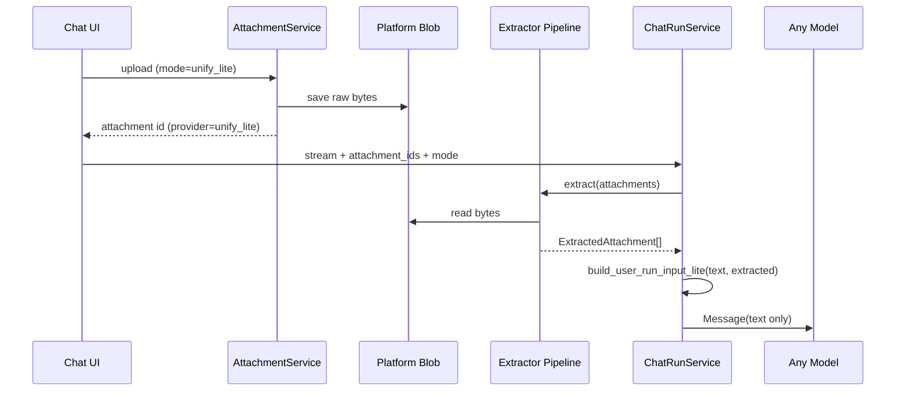

# Unify-lite 附件处理方案（v0 调研）

> 目标：不依赖各 LLM 的 Files / Vision native 能力，在平台侧统一解析附件并注入文本上下文，使切换模型时行为一致。  
> 范围：初版不含 RAG；支持 txt / md / word / xls / pdf / image。

---

## 1. 与 Native 模式对比

| 维度 | Native（现有） | Unify-lite（规划） |
|------|----------------|-------------------|
| 存储 | Provider Files API 或 inline vision blob | 平台 blob（已实现 upload stub） |
| LLM 输入 | `Content.from_hosted_file` / `Content.from_data` | **纯文本**（+ 可选图片描述块） |
| Provider 绑定 | 上传时绑定 model provider，换模型需重传 | **无 provider 绑定** |
| 能力差异 | Azure 仅 PDF+图；SiliconFlow 仅图；Anthropic 全类型 | 全模型统一：能解析即能用 |
| Token 成本 | 由 provider 内部处理 | 平台可控截断 / 摘要 |
| 多轮历史 | metadata 恢复 native Content | metadata 恢复已提取文本（或 lazy 再提取） |

---

## 2. 端到端流程（规划）



**关键原则**：Unify-lite 路径下 `build_user_run_input` 不再产生 `hosted_file` / image `Content`，只向模型发送结构化文本。

---

## 3. 提取管线（Extractor Pipeline）

### 3.1 按 MIME / 扩展名路由

| 类型 | 解析方式 | 依赖库（候选） | 输出 |
|------|---------|---------------|------|
| txt / md / csv / json | UTF-8 解码，失败则 chardet | stdlib + chardet | 原文 |
| docx | 段落 + 表格文本 | python-docx | 纯文本 |
| doc（legacy） | LibreOffice headless 或 KMS 转换 | 外部服务 | 纯文本 |
| xlsx | 按 sheet 导出 CSV 风格文本 | openpyxl | 表格文本 |
| xls（legacy） | xlrd 或 KMS 转换 | xlrd / 外部 | 表格文本 |
| pdf | 逐页 extract_text | pypdf / pdfplumber | 纯文本 |
| image | OCR 或 caption | pytesseract / 轻量 VL 描述 | `[Image: filename]\n{description}` |

初版可 **不支持** legacy `.doc` / `.xls`，或在文档中标注「需 KMS 转 docx/xlsx」。

### 3.2 统一输出结构

```python
@dataclass
class ExtractedAttachment:
    attachment_id: UUID
    filename: str
    mime_type: str
    kind: Literal["text", "image_description"]
    content: str          # 已截断的正文
    truncated: bool
    char_count: int
    extract_ms: int
    warnings: list[str]   # e.g. "empty pdf", "ocr low confidence"
```

### 3.3 注入 LLM 的消息格式

```markdown
{user_text}

---
[Attachments — unify-lite]

### report.pdf (application/pdf, 12.4 KB)
```
{extracted text…}
```

### screenshot.png (image/png, 245 KB)
[Image description]
A dashboard showing quarterly revenue…
---
```

- 固定分隔符便于调试与 replay
- 文件名 + MIME + 大小帮助模型引用来源
- 图片用 **文字描述** 而非 base64，保证纯文本模型可用

---

## 4. Token / 体积预算

| 策略 | 说明 |
|------|------|
| 单文件上限 | 例如 32k chars（可配置 `UNIFY_LITE_MAX_CHARS_PER_FILE`） |
| 消息总上限 | 例如 80k chars（`UNIFY_LITE_MAX_CHARS_PER_MESSAGE`） |
| 截断策略 | 头尾保留 + `… [truncated N chars]` 标记 |
| PDF 大文件 | 优先前 N 页；可选「目录 + 前几页」启发式 |
| Excel | 每 sheet 最多 M 行；超出行列省略 |
| 图片 | 描述限制 2k chars |

提取结果可 **缓存** 到 blob 旁 `{attachment_id}.extracted.json`，避免多轮对话重复解析。

---

## 5. 模块划分（与当前 refactor 对齐）

```
platform/attachments/
├── modes.py                 # native | unify_lite
├── validation.py            # 共享校验
├── storage.py               # 原始字节（inline/blob）
├── service.py               # 门面：按 mode 分发
├── native/                  # 现有 provider 路径
│   ├── upload.py
│   ├── adapters.py
│   └── maf_content.py
└── unify_lite/
    ├── handler.py           # upload + resolve（已有 stub）
    ├── extractors/          # 按类型拆分
    │   ├── text.py
    │   ├── office.py
    │   ├── pdf.py
    │   └── image.py
    ├── pipeline.py          # 编排 + 截断 + 缓存
    └── message_builder.py   # → build_user_run_input 的 lite 分支
```

`ChatRunService` 在 `attachment_mode=unify_lite` 时调用 `message_builder.build_user_run_input_lite()`，而非 `native.maf_content`。

---

## 6. 数据模型变更（可选 v1）

当前 `chat_attachments.provider = 'unify_lite'` 已可区分模式，无需 migration。

后续可增强：

- `extracted_text_cache_key` 或 JSONB `extract_meta`
- message metadata 增加 `attachment_mode`（**已实现**）与 `extracted_snapshot`（多轮 replay 用）

---

## 7. 与 KMS 平台对照点（待你方确认）

以下能力可能在 KMS 中已有，对接时可优先复用而非自建：

| 能力 | Unify-lite 需求 | KMS 可能提供的 |
|------|----------------|---------------|
| 文档解析 | docx/xlsx/pdf → text | 统一文档解析 API |
| OCR | 图片 → 文本 | OCR 服务 |
| 格式转换 | doc→docx, xls→xlsx | 转换队列 |
| 存储 | 原始文件 + 提取缓存 | 对象存储 / 文档库 |
| 异步任务 | 大 PDF 后台提取 | 任务编排 |

**集成策略建议**：

1. 定义平台内 `DocumentExtractor` Protocol：`extract(bytes, mime, filename) -> ExtractedAttachment`
2. 默认实现：本地 openpyxl / pypdf / python-docx（无 KMS 依赖）
3. KMS 实现：HTTP adapter，fallback 到本地
4. 配置项：`UNIFY_LITE_EXTRACTOR=local|kms`

---

## 8. 实现阶段建议

| 阶段 | 内容 | 产出 |
|------|------|------|
| **P0（当前）** | 前端模式切换 + 后端分层 + unify_lite upload | ✅ 本 PR |
| **P1** | txt/md/pdf/docx/xlsx 本地提取 + 文本注入 | 可用 unify-lite 发消息 |
| **P2** | 图片 OCR/描述 + 提取缓存 | 全类型覆盖 |
| **P3** | KMS adapter + 大文件异步 | 生产级 |
| **P4（可选）** | RAG 索引附件 chunk | 超出 lite 范围 |

---

## 9. 风险与限制

- **表格结构**：xlsx 转纯文本会丢失公式与样式，需在注入格式中说明
- **扫描版 PDF**：无 OCR 时几乎为空，需 P2 或 KMS OCR
- **Token 膨胀**：多附件 + 大 PDF 易超 context；必须硬截断 + 用户提示
- **延迟**：提取在 send 路径同步执行；大文件应改 async（P3）
- **安全**：解析器漏洞面（malformed docx/pdf）；需大小限制 + 沙箱可选

---

## 10. 配置项草案

```env
UNIFY_LITE_MAX_CHARS_PER_FILE=32000
UNIFY_LITE_MAX_CHARS_PER_MESSAGE=80000
UNIFY_LITE_EXTRACTOR=local          # local | kms
UNIFY_LITE_KMS_BASE_URL=            # 若接 KMS
UNIFY_LITE_IMAGE_MODE=describe      # describe | ocr | both
```

---

## 11. 测试计划

- 各类型 golden file → 稳定 extract snapshot
- 截断边界（刚好超 limit）
- native / unify_lite 附件混用应 reject（**已实现 resolve 校验**）
- 切换模型后 unify_lite 附件仍可发送
- 历史消息 replay：metadata 含 `attachment_mode=unify_lite` 时用 lite builder
